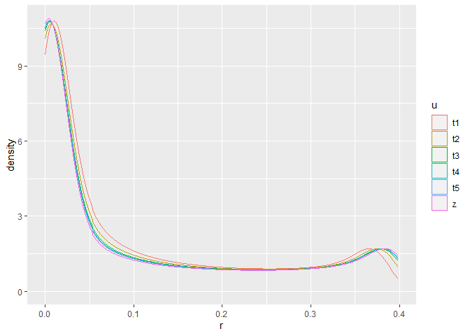

<html>


<h2 style={font-family: "XB Niloofar">
Statistical Calculations
</h2>

<h3 style={font-family: "XB Niloofar">
Author <br>
Amirhossein Khadivi <br> <br>
Supervisor <br>
Dr. Mohammad Kazemi <br> <br>
Department of Statistics, University of Guilan
<br>
</h3>

<p>

1- بسته نرم افزاری map را نصب و فراخوانی کنید و با استفاده از آن نقشه
ایران را خروجی بگیرید.

``` r
# install.packages('maps')
library(maps)
map('world','iran')
```

<!-- -->

<br> <br>

2-طول وتر یک مثلث قائم الزاویه با اضلاع کناری به طول 5 و 7 را به کمک
ماشین حساب کرده و حال میخواهیم آن را با R حساب کرده و نتایج را
مقایسه کنیم.

``` r
mh <- 8.602325267

a <- 7
b <- 5
c <- sqrt((a^2) + (b^2))
c
```

    ## [1] 8.602325

``` r
mh == c
```

    ## [1] FALSE

مشاهده می شود که نتایج تقریبا یکسان و اختلاف اندک آنها نیز به دلیل وجود
خطا در روش های عددی است.

<br> <br>

4,3- می خواهیم ریشه های مختلط معادله درجه دوم x^2 - x + 1 = 0 را در R
محاسبه کنیم و نتیجه را با جواب دستور polyroot که یک تابع برای محاسبه
عددی ریشه های معادلات است مقایسه کنیم.

``` r
a <- 1
b <- -1
c <- 1

delta <- (b^2) - (4*a*c)
d <- delta/(-1)
sqrt(d)
```

    ## [1] 1.732051

``` r
deltam <- 1.732051i
x1 <- (-b + deltam)/(2*a)
x2 <- (-b - deltam)/(2*a)
print(paste('x1 : ',x1))
```

    ## [1] "x1 :  0.5+0.8660255i"

``` r
print(paste('x2 : ',x2))
```

    ## [1] "x2 :  0.5-0.8660255i"

``` r
x <- c(x1,x2)

y <- polyroot(c(1,-1,1))
print(y)
```

    ## [1] 0.5+0.8660254i 0.5-0.8660254i

``` r
x == y
```

    ## [1] FALSE FALSE

مشاهده می شود که نتایج تقریبا یکسان هستند و اختلاف اندک آنها هم به دلیل
خطای محاسباتی است.

<br> <br>

5- میدانیم که مقدار cos(2arctan(x)) به ازای x=1 برابر صفر است. حال
میخواهیم ببینیم که جواب در R که از روش های عددی برای محاسبه این
عبارات استفاده میکند چقدر است.

``` r
x <- 0
y <- cos(2*atan(1))
y
```

    ## [1] 6.123032e-17

``` r
x == y
```

    ## [1] FALSE

مشاهده می شود که جواب صفر نشده ولی عددی بسیار کوچک و نزدیک به صفر است.
<br> <br> 6- می خواهیم تفاوت میان عملگرهای منطقی تکی(&,|)عملگرهای منطقی
دوتایی(&&,||) را بررسی کنیم.

``` r
x <- c(2<3,2!=2,2 != 2,2 <= 3)
y <- c(T,(3^2)==(2^3),F,1==1.0001)

x&y
```

    ## [1]  TRUE FALSE FALSE FALSE

``` r
x&&y
```

    ## [1] TRUE

``` r
x|y
```

    ## [1]  TRUE FALSE FALSE  TRUE

``` r
x||y
```

    ## [1] TRUE

همانطور که مشاهده می شود عملگرهای منطقی تکی تمام درایه های نظیر به نظیر
دو بردار را مقایسه می کنند ، ولی عملگرهای منطقی دوتایی فقط درایه اول
نظیر به نظیر دو بردار را مقایسه می کنند. <br> <br>

7- مقدار توابع چگالی احتمال توزیع های نرمال استاندارد و t-استیودنت با
درجه آزادی 5 در نقطه صفر را محاسبه می کنیم.

``` r
x <- dnorm(0)
y <- dt(0,5)
print(paste('X~N(0,1)   f(0)=',x))
```

    ## [1] "X~N(0,1)   f(0)= 0.398942280401433"

``` r
print(paste('X~t(5)     f(0)=',y))
```

    ## [1] "X~t(5)     f(0)= 0.379606689822494"

``` r
print(paste('Distance = ',abs(x-y)))
```

    ## [1] "Distance =  0.0193355905789382"

مشاهده می شود که دو عدد نزدیک به هم هستند ، و هرچه درجه آزادی توزیع t
بیشتر شود این اختلاف کمتر میشود. اگر درجه آزادی توزیع t به بی نهایت
میل کند این اختلاف به لحاظ حدی صفر خواهد بود. (طبق قضیه حد مرکزی) <br>
حال برای درک بهتر موضوع از نمودار استفاده می کنیم.

``` r
library(ggplot2)
library(dplyr)

x <- seq(-5,5,0.001)

z <- dnorm(x)
t1 <- dt(x,5)
t2 <- dt(x,10)
t3 <- dt(x,20)
t4 <- dt(x,30)
t5 <- dt(x,40)

data <- data.frame(x,z,t1,t2,t3,t4,t5)
d <- cbind(z,t1,t2,t3,t4,t5)
x1 <- 'N(0,1)' ; x2 <- 't(5)' ; x3 <- 't(10)' ; x4 <- 't(20)' ; x5 <- 't(30)' ; x6 <- 't(40)'
f <- function(x){
  sample(x,(length(d)/6),replace = T)
}
d1 <- cbind(f(x1),f(x2),f(x3),f(x4),f(x5),f(x6))
d2 <- as.factor(d1)
data2 <- data.frame(d,d2)
data %>% ggplot() + geom_point(aes(x=x,y=z),color = 'white') + geom_point(aes(x=x,y=t1),color =         'pink') + geom_point(aes(x=x,y=t2),color = 'green') + geom_point(aes(x=x,y=t3),color='yellow')       +  geom_point(aes(x=x,y=t4),color='red') + geom_point(aes(x=x,y=t5),color='blue') +          
     theme_dark()
```

<!-- -->

``` r
data2 %>% ggplot() + geom_density(aes(x=d,col = d2))
```

<!-- -->

<br> <br>

8- چندک 2.5 و 97.5 توزیع کوشی استاندارد را محاسبه می کنیم.

``` r
qcauchy(c(0.025 , 0.975),location = 0 , scale = 1)
```

    ## [1] -12.7062  12.7062

مشاهده می شود که دو نقطه قرینه یکدیگر هستند که به دلیل متقارن بودن این
توزیع هست.

<br> <br> حال میخواهیم متقارن بودن توزیع کوشی را در همین فاصله روی
نمودار نشان دهیم.

``` r
library(ggplot2)
library(dplyr)
x <- seq(-13,13,0.01)
y <- dcauchy(x,0,1)
data <- data.frame(x,y)
data %>% ggplot(aes(x=x,y=y)) + geom_point(color = 'white') + theme_dark()
```

<!-- -->

</p>

</body>

</html>
