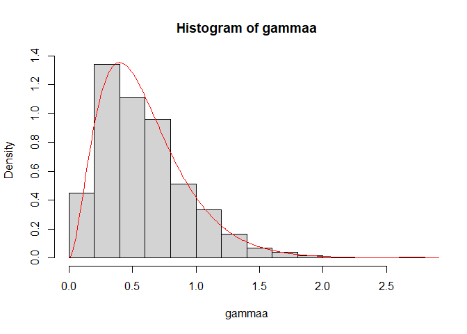

<html>

<style>
p   {align-text: center; font-family: "XB Niloofar"}
</style>

<body>

</body>

</html>

<html>

<body>

<style>
h2    {background-color:#001A80A6 ; text-align: center ; color:white}
h3    {background-color:#001A80A6 ; text-align: center ; color : white ; font-size:135%}
p     {direction: rtl; font-family: "XB Niloofar"}
</style>

<h2 style={font-family: "XB Niloofar">
Statistical Computing
</h2>

<style>
a:link {
  color: #dcc896;
  background-color: transparent;
  text-decoration: none;
}

a:visited {
  color: #dcc896;
  background-color: transparent;
  text-decoration: none;
}

a:hover {
  color:black ;
  background-color: transparent;
  text-decoration: underline;
}

a:active {
  color: #dcc896;
  background-color: transparent;
  text-decoration: underline;
}
</style>

<h3 style={font-family: "XB Niloofar">
Author <br>
Amirhossein Khadivi <br>
<a href='https://github.com/amirhossein-khadivi/SC/tree/master/1'title='GitHub'>Source Codes</a>
<br><br>
Supervisor <br>
Dr. Mohammad Kazemi <br> <br>
Department of Statistics, University of Guilan
<br>
</h3>

<p>

<br> <br>

1- نمودار پراکنش برای داده های زیررسم می کنیم.

``` r
attach(airquality)
plot(Temp, Ozone)
```

<!-- -->

``` r
detach(airquality)
```

<br> <br>

2- یک نمونه تصادفی از توزیع گامابا پارامتر شکل3و پارامتر مقیاس 5 شبیه
سازی کرده و سپس نمودار هیستوگرام آن را رسم کرده ، در نهایت هم نمودار
چگالی داده ها را به هیستوگرام اضافه می کنیم.

``` r
gammaa <- rgamma(1000, 3, 5)
x <- seq(0, 3, 0.01)
fx <- dgamma(x, 3, 5)
hist(gammaa, freq = F, ylim = c(0, max(fx)))
lines(x, fx, col = 'red')
```

<!-- --> <br> <br>

3- نمودار رزقطبی را با معادله ای که در سلول کد زیر موجود است رسم می کنیم
و نیمسازهای اول و سوم صفحه را به آن اضافه می کنیم.

``` r
theta <- seq(-1, 1, 0.01)
k <- 3
r <- cos(k * theta)
plot(r, theta, type = 'l')
y <- r
lines(r, y, col = 'blue')
```

<!-- -->

<br> <br>

4- نمودار جعبه ای میزان افزایش خواب دو داروی خواب آور را در چارچوب داده
ی sleep در کنار هم و به صورت افقی رسم می کنیم.

``` r
attach(sleep)
boxplot(extra ~ group , data = sleep , horizontal = T)
```

<!-- --> <br> همانطور که
از نمودار مشخص است میزان افزایش خواب در اثر مصرف داروی نوع دوم بیشتر از
داروی نوع اول است.

<br> <br>

5- برای داده هایمان بدون استفاده از تابع barplot نمودار میله ای رسم می
کنیم.

``` r
y <- table(group)
plot(y,
     lwd = 100,
     col = 'blue',
     xlim = c(0, 3))
```

<!-- -->

``` r
detach(sleep)
```

<br> <br>

</p>

</body>

</html>
