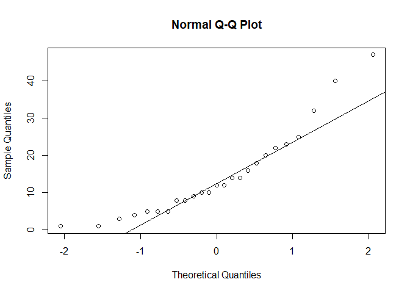
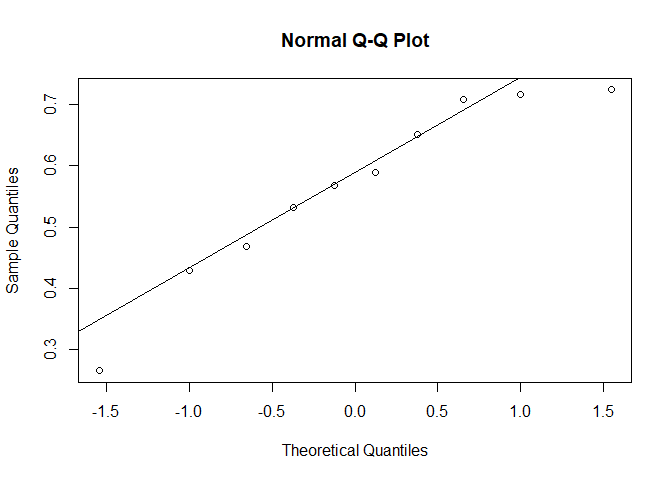
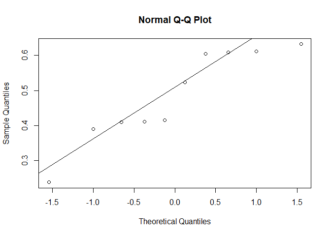

<html>

<style>
p   {align-text: center; font-family: "XB Niloofar"}
</style>

<body>

</body>

</html>

<html>

<body>

<style>
h2    {background-color:#001A80A6 ; text-align: center ; color:white}
h3    {background-color:#001A80A6 ; text-align: center ; color : white ; font-size:135%}
p     {direction: rtl; font-family: "XB Niloofar"}
</style>

<h2 style={font-family: "XB Niloofar">
Statistical Calculations
</h2>

<h3 style={font-family: "XB Niloofar">
Author <br>
Amirhossein Khadivi <br> <br>
Supervisor <br>
Dr. Mohammad Kazemi <br> <br>
Department of Statistics, University of Guilan
<br>
</h3>

<p>

<br> <br>

1- برای بررسی میانگین تعداد روزهای مرخصی کارمندان یک شرکت بزگ نمونه ای
به اندازه ی 25 کارمند انتخابو تعداد روزهای مرخصی آن ها در یک سال گذشته
در یک متغیر ذخیره کرده ایم. <br> میخواهیم فرض نرمال بودن داده ها در سطح
0.05 بررسی کنیم.

``` r
x <- c(5,25,10,1,3,5,12,14,40,12,32,8,4,47,20,14,18,16,10,1,22,8,5,23,9)

library(nortest)
qqnorm(x) ; qqline(x)
```

<!-- -->

``` r
shapiro.test(x)
```

    ## 
    ##  Shapiro-Wilk normality test
    ## 
    ## data:  x
    ## W = 0.88521, p-value = 0.008866

``` r
ks.test(x,'pnorm',mean=mean(x),sd=sd(x))
```

    ## Warning in ks.test(x, "pnorm", mean = mean(x), sd = sd(x)): ties should not be
    ## present for the Kolmogorov-Smirnov test

    ## 
    ##  One-sample Kolmogorov-Smirnov test
    ## 
    ## data:  x
    ## D = 0.15892, p-value = 0.5529
    ## alternative hypothesis: two-sided

``` r
lillie.test(x)
```

    ## 
    ##  Lilliefors (Kolmogorov-Smirnov) normality test
    ## 
    ## data:  x
    ## D = 0.15892, p-value = 0.1061

``` r
ad.test(x)
```

    ## 
    ##  Anderson-Darling normality test
    ## 
    ## data:  x
    ## A = 0.89328, p-value = 0.01903

<br> ابتدا با رسم نمودار چندک چندک یا به عبارت دقیق تر در اینجا نمودار
احتمال نرمال به دلیل نزدیک نبودن به خط رسم شده و وجود داده های
دورافتاده زیاد نبت به خط به صورت شهودی فرض نرمال بودن داده ها را
رد میکنیم. <br> اما برای بررسی دقیق تر باید باید به استنباط آماری و
آزمون های فرض بپردازیم. <br> در اینجا به ترتیب از چهار آزمون فرض
شاپیرو ویلک و کولموگروف اسمیرنف و لیلیفورس و اندرسون دارلینگ استفاده
میکنیم. <br> که با توجه به پی مقدارها آزمون های شاپیرو ویلک و اندرسون
دارلینگ فرض نرمال بودن داده ها را در سطح 0.05 رد میکنند. <br> بنابراین
فرض نرمال بودن داده ها را رد میکنیم. <br> همچنین دلیل هشدار در آزمون
کولموگروف اسمیرنف نیز این هست که این آزمون برای توزیع های پیوسته هست
ولی چون در این داده ها ، داده ی تکراری داریم به همین دلیل هشدار دریافت
میکنیم. <br> <br>

2- با توجه به داده های سوال قبل میخواهیم فرض اینکه میانگین تعداد تعداد
روزهای مرخصی کارمندان 12 روز هست یا نه را در سطح 0.05 بررسی کنیم.

``` r
wilcox.test(x,mu = 12)
```

    ## Warning in wilcox.test.default(x, mu = 12): cannot compute exact p-value with
    ## ties

    ## Warning in wilcox.test.default(x, mu = 12): cannot compute exact p-value with
    ## zeroes

    ## 
    ##  Wilcoxon signed rank test with continuity correction
    ## 
    ## data:  x
    ## V = 154.5, p-value = 0.6261
    ## alternative hypothesis: true location is not equal to 12

``` r
wilcox.test(x,mu = 12,exact = F)
```

    ## 
    ##  Wilcoxon signed rank test with continuity correction
    ## 
    ## data:  x
    ## V = 154.5, p-value = 0.6261
    ## alternative hypothesis: true location is not equal to 12

<br> با توجه به اینکه فرض نرمال بودن داده ها رد شده بود باید از آزمون
فرض ناپارامتری ویلکاکسون استفاده کنیم. <br> در ابتدا به ما یک هشدار
میدهد و آن هم این است که نمیتواند پی مقدار را دقیق محاسبه کند. به همین
دلیل آرگومان مربوطه را FALSE میکنیم. <br> با توجه به پی مقدارفرض صفر
آزمون یعنی 12 بودن میانگین تعداد روزهای مرخصی کارمندان قویا تایید
میشود. <br> <br>

3- در یکی از بیمارستان های ملبورن استرالیا ، از اکتبر 1961 تا دسامبر
1964 ، تعداد 98دوقلو به دنیا آمده اندکه جنسیت 29 تا از آن ها هر دو پسر ،
36 تا هر دو دختر و 33 تا یک پسر و یک دختر بوده است.اگر p1 , p2 , p3
بیانگر نسبت های دوقلوهاییر در ملبورن باشند که به ترتیب هر دو پسر ،
هر دو دختر و یک پسر و یک دختر در نظر بگیریم ، میخواهیم فرض H0 :
p1=p2=1/4,p3=1/2 را در سطح 0.05 بررسی کنیم.

``` r
n <- 98
x1 <- 29 # two boys
x2 <- 36 # two girls
x3 <- 33 # one boy & one girl

prop.test(c(x1,x2,x3),c(n,n,n),p=c(0.25,0.25,0.5))
```

    ## 
    ##  3-sample test for given proportions without continuity correction
    ## 
    ## data:  c(x1, x2, x3) out of c(n, n, n), null probabilities c(0.25, 0.25, 0.5)
    ## X-squared = 18.748, df = 3, p-value = 0.0003082
    ## alternative hypothesis: two.sided
    ## null values:
    ## prop 1 prop 2 prop 3 
    ##   0.25   0.25   0.50 
    ## sample estimates:
    ##    prop 1    prop 2    prop 3 
    ## 0.2959184 0.3673469 0.3367347

<br> با توجه به پی مقدار آزمون فرض صفری که میخواستیم بررسی کنیم در سطح
0.05 رد میشود، همیچنین از اختلاف زیاد بین مقدار برآورد p ها و مقدار فرض
p ها نیز می توان این نتیجه را به دست آورد. <br> <br>

4- از آب سطح و ته 10 دریاچه ی طبیعی در یک کشور نمونه هایی استخراج و
میزان روی در این نمونه ها در دو متغیر در سلول کد زیر ثبت کرده ایم،
می خواهیم برابری میزان روی در آب سطح و ته دریاچه ها را در سطح 0.05
بررسی کنیم.

``` r
x1 <- c(0.43,0.266,0.567,0.531,0.707,0.716,0.651,0.589,0.469,0.723)
x2 <- c(0.415,0.238,0.39,0.41,0.605,0.609,0.632,0.523,0.411,0.612)

shapiro.test(x1)
```

    ## 
    ##  Shapiro-Wilk normality test
    ## 
    ## data:  x1
    ## W = 0.92236, p-value = 0.3771

``` r
shapiro.test(x2)
```

    ## 
    ##  Shapiro-Wilk normality test
    ## 
    ## data:  x2
    ## W = 0.88271, p-value = 0.1402

``` r
qqnorm(x1) ; qqline(x1)
```

<!-- -->

``` r
qqnorm(x2) ; qqline(x2)
```

<!-- -->

``` r
t.test(x1,x2,paired = T)
```

    ## 
    ##  Paired t-test
    ## 
    ## data:  x1 and x2
    ## t = 4.8638, df = 9, p-value = 0.0008911
    ## alternative hypothesis: true difference in means is not equal to 0
    ## 95 percent confidence interval:
    ##  0.043006 0.117794
    ## sample estimates:
    ## mean of the differences 
    ##                  0.0804

<br> ابتدا فرض نرمال بودن داده ها را بررسی میکنیم. <br> با توجه به
نمودار احتمال نرمال ها نمیتوانیم درست تصمیم بگیریم و به همین دلیل
به آزمون فرض روی می آوریم که از آزمون شاپیرو ویلک بهره میجوییم. <br> با
توجه به پی مقدار ها نرمال بودن هر دو بردار داده ها در سطح 0.05 تایید
میشود. <br> بنابراین از آزمون پارامتری تی زوجی استفاده می کنیم. <br>
مشاهده میشود که با توجه به پی مقدار آزمون فرض برابری میزان روی در سطح و
ته دریاچه ها در سطح 0.05 رد میشود. <br> <br>

5- متغیرهای mpg , gear در چارچوب داده ای mtcars در R به ترتیب در
بردارنده ی میزان مصرف سوخت (مایل به ازای یک گالن سوخت) و تعداد
دنده های 32 مشاهده ی مربوط به 11 خودرو هستند. با گروه بندی خودروها
براساس تعداد دنده های آن ها ، میخواهیم آزمون های برابری میانگین ها و
همگنی واریانس ها برای مصرف سوخت این خودروها را بررسی کنیم.

``` r
x1 <- mtcars$mpg[mtcars$gear==3]
x2 <- mtcars$mpg[mtcars$gear==4]
x3 <- mtcars$mpg[mtcars$gear==5]

shapiro.test(x1)
```

    ## 
    ##  Shapiro-Wilk normality test
    ## 
    ## data:  x1
    ## W = 0.95833, p-value = 0.6634

``` r
shapiro.test(x2)
```

    ## 
    ##  Shapiro-Wilk normality test
    ## 
    ## data:  x2
    ## W = 0.90908, p-value = 0.2076

``` r
shapiro.test(x3)
```

    ## 
    ##  Shapiro-Wilk normality test
    ## 
    ## data:  x3
    ## W = 0.90897, p-value = 0.4614

``` r
varr <- bartlett.test(mpg~gear , data = mtcars)
vaarrr <- varr$p.value

if(vaarrr > 0.05){
  print('var.equal = T')
  one <- oneway.test(mpg~gear , data = mtcars , var.equal =  T)
  print(one)
}else{
  print('var.equal = F')
  one<- oneway.test(mpg~gear , data = mtcars , var.equal = F)
  print(one)
}
```

    ## [1] "var.equal = T"
    ## 
    ##  One-way analysis of means
    ## 
    ## data:  mpg and gear
    ## F = 10.901, num df = 2, denom df = 29, p-value = 0.0002948

``` r
if(one$p.value < 0.05)
pairwise.t.test(mtcars$mpg , mtcars$gear)
```

    ## 
    ##  Pairwise comparisons using t tests with pooled SD 
    ## 
    ## data:  mtcars$mpg and mtcars$gear 
    ## 
    ##   3       4      
    ## 4 0.00022 -      
    ## 5 0.07684 0.21832
    ## 
    ## P value adjustment method: holm

<br> ابتدا فرض نرمال بودن توزیع داده ها را با آزمون شاپیرو ویلک در سطح
0.05 بررسی میکنیم ، با توجه به پی مقدارها فرض نرمال بودن هر سه گروه یا
جامعه تایید می شود. <br> حال مجوز استفاده از روش پارامتری تحلیل
واریانس یک طرفه را برای بررسی برابری یا نابرابری میانگین های چند
جامعه استفاده کنیم. <br> قبل از تحلیل واریانس باید مشخص کنیم که واریانس
ها همگن است یا خیر که با توجه به پی مقدار همگنی واریانس ها تایید می شود
. <br> در ادامه تحلیل واریانس یک طرفه با واریانس همگن را انجام میدهیم و
در سطح 0.05 فرض برابری میانگین های سه جامعه رد می شود. <br> در نهایت می
خواهیم ببینیم که میانگین کدام یک از جوامع دو به دو با هم متفاوت است.
<br> با توجه به پی مقدارهای آزمون های تی تست برای هر دو جامعه مشاهده می
شود که در سطح 0.05 میانگین جامعه 3 و 4 با هم تفاوت معنادار دارند. <br>

<br>

</p>

</body>

</html>
