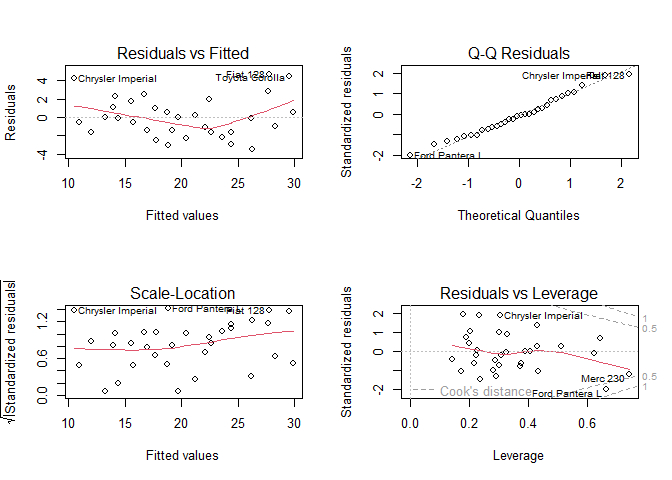

<html>


<h2 style={font-family: "XB Niloofar">
Statistical Computing
</h2>
<h3 style={font-family: "XB Niloofar">
Author <br>
Amirhossein Khadivi <br>
<a href='https://github.com/amirhossein-khadivi/SC/tree/master'title='GitHub'>Source Codes</a>
<br><br>
Supervisor <br>
Dr. Mohammad Kazemi <br> <br>
Department of Statistics, University of Guilan
<br>
</h3>

<p>

داده های چارچوب mtcars را مشاهده می کنیم.

``` r
data(mtcars)
attach(mtcars)
mtcars
```

    ##                      mpg cyl  disp  hp drat    wt  qsec vs am gear carb
    ## Mazda RX4           21.0   6 160.0 110 3.90 2.620 16.46  0  1    4    4
    ## Mazda RX4 Wag       21.0   6 160.0 110 3.90 2.875 17.02  0  1    4    4
    ## Datsun 710          22.8   4 108.0  93 3.85 2.320 18.61  1  1    4    1
    ## Hornet 4 Drive      21.4   6 258.0 110 3.08 3.215 19.44  1  0    3    1
    ## Hornet Sportabout   18.7   8 360.0 175 3.15 3.440 17.02  0  0    3    2
    ## Valiant             18.1   6 225.0 105 2.76 3.460 20.22  1  0    3    1
    ## Duster 360          14.3   8 360.0 245 3.21 3.570 15.84  0  0    3    4
    ## Merc 240D           24.4   4 146.7  62 3.69 3.190 20.00  1  0    4    2
    ## Merc 230            22.8   4 140.8  95 3.92 3.150 22.90  1  0    4    2
    ## Merc 280            19.2   6 167.6 123 3.92 3.440 18.30  1  0    4    4
    ## Merc 280C           17.8   6 167.6 123 3.92 3.440 18.90  1  0    4    4
    ## Merc 450SE          16.4   8 275.8 180 3.07 4.070 17.40  0  0    3    3
    ## Merc 450SL          17.3   8 275.8 180 3.07 3.730 17.60  0  0    3    3
    ## Merc 450SLC         15.2   8 275.8 180 3.07 3.780 18.00  0  0    3    3
    ## Cadillac Fleetwood  10.4   8 472.0 205 2.93 5.250 17.98  0  0    3    4
    ## Lincoln Continental 10.4   8 460.0 215 3.00 5.424 17.82  0  0    3    4
    ## Chrysler Imperial   14.7   8 440.0 230 3.23 5.345 17.42  0  0    3    4
    ## Fiat 128            32.4   4  78.7  66 4.08 2.200 19.47  1  1    4    1
    ## Honda Civic         30.4   4  75.7  52 4.93 1.615 18.52  1  1    4    2
    ## Toyota Corolla      33.9   4  71.1  65 4.22 1.835 19.90  1  1    4    1
    ## Toyota Corona       21.5   4 120.1  97 3.70 2.465 20.01  1  0    3    1
    ## Dodge Challenger    15.5   8 318.0 150 2.76 3.520 16.87  0  0    3    2
    ## AMC Javelin         15.2   8 304.0 150 3.15 3.435 17.30  0  0    3    2
    ## Camaro Z28          13.3   8 350.0 245 3.73 3.840 15.41  0  0    3    4
    ## Pontiac Firebird    19.2   8 400.0 175 3.08 3.845 17.05  0  0    3    2
    ## Fiat X1-9           27.3   4  79.0  66 4.08 1.935 18.90  1  1    4    1
    ## Porsche 914-2       26.0   4 120.3  91 4.43 2.140 16.70  0  1    5    2
    ## Lotus Europa        30.4   4  95.1 113 3.77 1.513 16.90  1  1    5    2
    ## Ford Pantera L      15.8   8 351.0 264 4.22 3.170 14.50  0  1    5    4
    ## Ferrari Dino        19.7   6 145.0 175 3.62 2.770 15.50  0  1    5    6
    ## Maserati Bora       15.0   8 301.0 335 3.54 3.570 14.60  0  1    5    8
    ## Volvo 142E          21.4   4 121.0 109 4.11 2.780 18.60  1  1    4    2

<br>

1- با در نظر گرفتن متغیر mpg در چارچوب داده ای mtcars به عنوان متغیر
پاسخ و دیگر متغیرها به عنوان متغیر مستقل ، یک مدل رگرسیون خطی را به
این داده ها برازش میدهیم.

``` r
fit <- lm(mpg ~ ., data = mtcars)
summary(fit)
```

    ## 
    ## Call:
    ## lm(formula = mpg ~ ., data = mtcars)
    ## 
    ## Residuals:
    ##     Min      1Q  Median      3Q     Max 
    ## -3.4506 -1.6044 -0.1196  1.2193  4.6271 
    ## 
    ## Coefficients:
    ##             Estimate Std. Error t value Pr(>|t|)  
    ## (Intercept) 12.30337   18.71788   0.657   0.5181  
    ## cyl         -0.11144    1.04502  -0.107   0.9161  
    ## disp         0.01334    0.01786   0.747   0.4635  
    ## hp          -0.02148    0.02177  -0.987   0.3350  
    ## drat         0.78711    1.63537   0.481   0.6353  
    ## wt          -3.71530    1.89441  -1.961   0.0633 .
    ## qsec         0.82104    0.73084   1.123   0.2739  
    ## vs           0.31776    2.10451   0.151   0.8814  
    ## am           2.52023    2.05665   1.225   0.2340  
    ## gear         0.65541    1.49326   0.439   0.6652  
    ## carb        -0.19942    0.82875  -0.241   0.8122  
    ## ---
    ## Signif. codes:  0 '***' 0.001 '**' 0.01 '*' 0.05 '.' 0.1 ' ' 1
    ## 
    ## Residual standard error: 2.65 on 21 degrees of freedom
    ## Multiple R-squared:  0.869,  Adjusted R-squared:  0.8066 
    ## F-statistic: 13.93 on 10 and 21 DF,  p-value: 3.793e-07

<br> در ابتدا فرمول مدل و در ادامه چارک های باقی مانده ها را مشاهده می
کنیم. <br> در جدول ضرایب هم براورد ضرایب و انحراف معیار براورد و آماره
t و در نهایت پی مقدارهای مربوط به آن ها را می بینیم. با توجه به پی
مقدارها فرض صفر آزمون تمام ضرایب یعنی صفر بودن تمام ضرایب و همچنین
نبود الزام حضور آن ها در مدل تایید می شود. <br> همچنین براورد واریانس
خطاها 2.65 درجه آزادی 21 (n-(p+1)) است ، ضریب تعیین چندگانه برابر
0.869 و ضریب تعیین تعدیل شده برابر 0.8066 است که به این معنی است که از
تغییرات متغیر پاسخ 80.66 درصد آن مربوط به مدل است. <br> آماره F برابر
13.93 با درجات آزادی 10 (p+1) و 21 (n-(p+1)) است. <br> پی مقدار آزمون
کلی مدل نیز به دلیل بسیار کوچک بودن معناداری کلی مدل را تایید می کند
این نتیجه با توجه به نتایج آزمون ضرایب نشان دهنده ی وجود همخطی میان
متغیرهای مستقل می تواند باشد.

<br> <br> <br>

2- جدول تحلیل واریانس مدل برازش داده شده را محاسبه می کنیم.

``` r
anova(fit)
```

    ## Analysis of Variance Table
    ## 
    ## Response: mpg
    ##           Df Sum Sq Mean Sq  F value    Pr(>F)    
    ## cyl        1 817.71  817.71 116.4245 5.034e-10 ***
    ## disp       1  37.59   37.59   5.3526  0.030911 *  
    ## hp         1   9.37    9.37   1.3342  0.261031    
    ## drat       1  16.47   16.47   2.3446  0.140644    
    ## wt         1  77.48   77.48  11.0309  0.003244 ** 
    ## qsec       1   3.95    3.95   0.5623  0.461656    
    ## vs         1   0.13    0.13   0.0185  0.893173    
    ## am         1  14.47   14.47   2.0608  0.165858    
    ## gear       1   0.97    0.97   0.1384  0.713653    
    ## carb       1   0.41    0.41   0.0579  0.812179    
    ## Residuals 21 147.49    7.02                       
    ## ---
    ## Signif. codes:  0 '***' 0.001 '**' 0.01 '*' 0.05 '.' 0.1 ' ' 1

<br> ابتدا مشاهده می شود که متغیر پاسخ mpg است. <br> در ادامه در منبع
تغییرات به تفکیک متغیرهای مستقل و خطا را می بینیم که در ستون اول
درجات آزادی ، ستون دوم مجموع مربعات ، ستون سوم میانگین مربعات ،
ستون چهارم آماره F و در ستون آخر پی مقدار مربوط به آزمون فرض هر
متغیر را می بینیم ، که با توجه به پی مقدار آزمون لزوم وجود متغیرهای
cyl , disp , qsec در مدل در سطح 0.05 تایید می شود. <br> <br> <br>

3- حال برای مدلی که برازش دادیم میخواهیم نمودارهای تشخیصی را برای بررسی
فرض های بنیادی مدل رسم می کنیم.

``` r
par(mfrow = c(2, 2))
plot(fit)
```

<!-- --> <br> در اولین
نمودار از سمت چپ میتوانیم تقریبا فرض خطی بودن مدل را تایید کنیم ولی
تا حدودی یک فرم سینوسی در نمودار مشاهده می شود برای بررسی دقیق تر این
فرض باید از نمودارهای متغیرهای اضافه شده کمک بگیریم. <br> از اولین
نمودار سمت راست نیز می توانیم برای بررسی فرض نرمال بودن مانده ها
استفاده کنیم که با توجه به قرارگرفتن تقریبی داده ها حول خط راست
میتوانیم فرض نرمال بودن داده ها را بپذیریم ولی برای بررسی دقیق تر
باید از آزمون فرض استفاده کنیم. <br> از دومین نمودار سمت راست برای
بررسی فرض همگنی واریانس ها استفاده میکنیم.که چون در نمودار الگوی
خاصی دیده نمی شود همگنی واریانس خطاها تایید میشود. <br> از دومین
نمودار سمت راست هم برای بررسی وجود یا عدم وجود داده های دورافتاده
بررسی می شود که با به نمودار به دلیل پایین تر بودن یک داده از کران
پایین فاصله کوک وجود داده ی دور افتاده نیز تایید می شود که برای بی
اثر کردن آن می توانیم آن را حذف کرده یا ترجیحا از رگرسیون های استوار
استفاده کنیم. <br> برای بررسی فرض ناهمبستگی خطاها نیز میتوانیم از
نمودار خودهبستگی یا آماره ی دوربین واتسون استفاده کنیم.

<br> <br> <br>

4- به کمک روش گام به گام میخواهیم متغیرهایی راکه باید از مدل برازش داده
شده حذف شوند مشخص کنیم.

``` r
step(lm(mpg ~ 1 , data = mtcars),
     scope = . ~ cyl + disp + hp + drat + wt + qsec + vs + am + carb)
```

    ## Start:  AIC=115.94
    ## mpg ~ 1
    ## 
    ##        Df Sum of Sq     RSS     AIC
    ## + wt    1    847.73  278.32  73.217
    ## + cyl   1    817.71  308.33  76.494
    ## + disp  1    808.89  317.16  77.397
    ## + hp    1    678.37  447.67  88.427
    ## + drat  1    522.48  603.57  97.988
    ## + vs    1    496.53  629.52  99.335
    ## + am    1    405.15  720.90 103.672
    ## + carb  1    341.78  784.27 106.369
    ## + qsec  1    197.39  928.66 111.776
    ## <none>              1126.05 115.943
    ## 
    ## Step:  AIC=73.22
    ## mpg ~ wt
    ## 
    ##        Df Sum of Sq     RSS     AIC
    ## + cyl   1     87.15  191.17  63.198
    ## + hp    1     83.27  195.05  63.840
    ## + qsec  1     82.86  195.46  63.908
    ## + vs    1     54.23  224.09  68.283
    ## + carb  1     44.60  233.72  69.628
    ## + disp  1     31.64  246.68  71.356
    ## <none>               278.32  73.217
    ## + drat  1      9.08  269.24  74.156
    ## + am    1      0.00  278.32  75.217
    ## - wt    1    847.73 1126.05 115.943
    ## 
    ## Step:  AIC=63.2
    ## mpg ~ wt + cyl
    ## 
    ##        Df Sum of Sq    RSS    AIC
    ## + hp    1    14.551 176.62 62.665
    ## + carb  1    13.772 177.40 62.805
    ## <none>              191.17 63.198
    ## + qsec  1    10.567 180.60 63.378
    ## + disp  1     2.680 188.49 64.746
    ## + vs    1     0.706 190.47 65.080
    ## + am    1     0.125 191.05 65.177
    ## + drat  1     0.001 191.17 65.198
    ## - cyl   1    87.150 278.32 73.217
    ## - wt    1   117.162 308.33 76.494
    ## 
    ## Step:  AIC=62.66
    ## mpg ~ wt + cyl + hp
    ## 
    ##        Df Sum of Sq    RSS    AIC
    ## <none>              176.62 62.665
    ## - hp    1    14.551 191.17 63.198
    ## + am    1     6.623 170.00 63.442
    ## + disp  1     6.176 170.44 63.526
    ## - cyl   1    18.427 195.05 63.840
    ## + carb  1     2.519 174.10 64.205
    ## + drat  1     2.245 174.38 64.255
    ## + qsec  1     1.401 175.22 64.410
    ## + vs    1     0.060 176.56 64.654
    ## - wt    1   115.354 291.98 76.750

    ## 
    ## Call:
    ## lm(formula = mpg ~ wt + cyl + hp, data = mtcars)
    ## 
    ## Coefficients:
    ## (Intercept)           wt          cyl           hp  
    ##    38.75179     -3.16697     -0.94162     -0.01804

<br> در روش بالا مدل فقط با عرض از مبدا به عنوان مدل آغازین و همه
متغیرهای موجود در شناسه ی scope به عنوان متغیرهایی که می توانند
در مدل نهایی حضور داشته باشند مشخص شده اند. روش گام به گام با کمک
معیار AIC بهترین متغیرها را برای حضور در مدل انتخاب میکند. به این
صورت که با اضافه کردن هر متغیر به مدل قبل مدل های جدیدی میسازد که هر
مدلی که AIC کمتری داشته باشد آن متغیر به مدل اضافه می شود. <br> در
اینجا نیز در نهایت متغیرهای wt , cyl , hp برای حضور در مدل انتخاب می
شوند و براورد ضرایب آنها به اضافه ی براورد عرض از مبدا محاسبه می شود.

<br> <br> <br>

5- می خواهیم تابع آماره سی پی مالوز را نوشته و برای مدل برازش داده شده
محاسبه کنیم.

``` r
cp <- function(n, SSE, p, sigmaa) {
  cp <- (1 / n) * (SSE + (2 * p * sigmaa))
  print(cp)
}
```

``` r
p <- length(fit$coefficients) - 1
n <- length(mtcars$mpg)
a <- anova(fit)
b <- a$`Sum Sq`
sse <- b[11]
sigmma <- 2.65
cp(n, sse, p, sigmma)
```

    ## [1] 6.265451

<br> در آخر معیار سی پی مالوز را برای مدل برازش شده محاسبه کردیم.

<br> <br>

</p>

</body>

</html>
