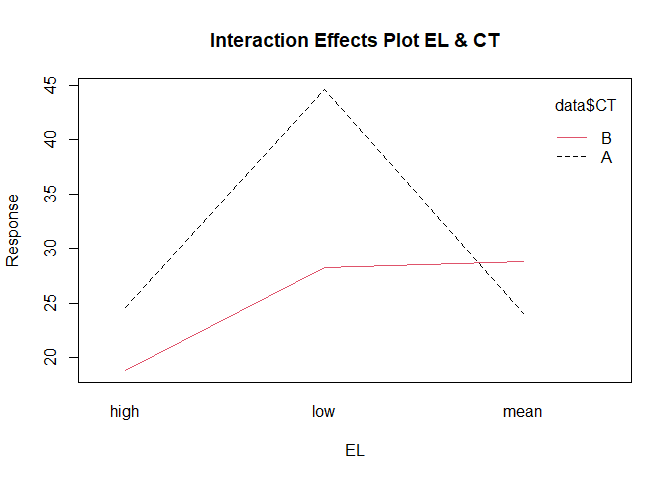

<html>

<style>
  
p   {align-text: center; font-family: "XB Niloofar"}
</style>

<body>

</body>

</html>

<html>

<body>

<style>
h2    {background-color:#001A80A6 ; text-align: center ; color:white}
h3    {background-color:#001A80A6 ; text-align: center ; color : white ; font-size:135%}
p     {direction: rtl; font-family: "XB Niloofar"}
</style>

<h2 style={font-family: "XB Niloofar">
Statistical Computing
</h2>
<h3 style={font-family: "XB Niloofar">
Author <br>
Amirhossein Khadivi <br>
<a href='https://github.com/amirhossein-khadivi/SC/tree/master'title='GitHub'>Source Codes</a>
<br><br>
Supervisor <br>
Dr. Mohammad Kazemi <br> <br>
Department of Statistics, University of Guilan
<br>
</h3>

<p>

<br>

``` r
library(MASS)
library(dplyr)
library(ggplot2)
library(car)
library(bayesforecast)
library(nortest)
```

<br><br><br>

۱- در یک نظرسنجی پیش از انتخابات ریاست جمهوری از ۲۱۰ زن و مرد که به
تصادف انتخاب شده بودند پرسیده شد به کدام یک از ۴ نامزد ریاست جمهوری
رای می دهند. نتایج در سلول کد زیر ذخیره شده اند. در سطح خطای ۰.۰۵
میخواهیم بررسی کنیم که آیا جنسیت پاسخ گو بر انتخاب نامزد انتخابی
تاثیر داشته است یا خیر.

``` r
dat <- matrix(c(15, 16, 9, 7, 19, 72, 23, 49), ncol = 4)
dimnames(dat) <-
  list(Responder = c('Woman', 'Man'),
       Candidate = c('N4', 'N3', 'N2', 'N1'))
data <- as.table(dat)
data
```

    ##          Candidate
    ## Responder N4 N3 N2 N1
    ##     Woman 15  9 19 23
    ##     Man   16  7 72 49

``` r
chisq.test(data)
```

    ## 
    ##  Pearson's Chi-squared test
    ## 
    ## data:  data
    ## X-squared = 13.419, df = 3, p-value = 0.003813

``` r
fisher.test(data)
```

    ## 
    ##  Fisher's Exact Test for Count Data
    ## 
    ## data:  data
    ## p-value = 0.003716
    ## alternative hypothesis: two.sided

با توجه به پی مقدار آزمون کای دو و آزمون دقیق فیشر که هر دو کوچکتر از
۰.۰۵ هستند فرض صفردو آزمون که استقلال سطوح دو متغیر کاندیدای مربوط و
جنسیت هست رد میشود که این نتیجه نشان از تاثیر جنسیت درانتخاب نامزد
انتخاباتی دارد.

<br> <br>

۲- جدول توافقی سه طرفه ی HairEyeColor شامل سه متغیر جنسیت(با دو سطح خانم
و آقا) و رنگ مو (با ۴ سطح مشکی-قهوه ای-قرمز-بلوند) و رنگ چشم(با ۴ سطح
قهوه ای-آبی-میشی و سبز) هست که میخواهیم استقلال این سه متغیر گسسته از
هم را بررسی کنیم.

``` r
HairEyeColor
```

    ## , , Sex = Male
    ## 
    ##        Eye
    ## Hair    Brown Blue Hazel Green
    ##   Black    32   11    10     3
    ##   Brown    53   50    25    15
    ##   Red      10   10     7     7
    ##   Blond     3   30     5     8
    ## 
    ## , , Sex = Female
    ## 
    ##        Eye
    ## Hair    Brown Blue Hazel Green
    ##   Black    36    9     5     2
    ##   Brown    66   34    29    14
    ##   Red      16    7     7     7
    ##   Blond     4   64     5     8

<br> برای بررسی استقلال میان سه متغیر گسسته در قالب یک جدول توافقی از یک
مدل لگ خطی کمک می گیریم.

``` r
loglm(data = HairEyeColor,  ~ Sex + Hair + Eye)
```

    ## Call:
    ## loglm(formula = ~Sex + Hair + Eye, data = HairEyeColor)
    ## 
    ## Statistics:
    ##                       X^2 df P(> X^2)
    ## Likelihood Ratio 166.3001 24        0
    ## Pearson          164.9247 24        0

با توجه به پی مقدارهای مقدار درستنمایی و پیرسون فرض صفر یعنی استقلال بین
سطوح مختلف سه متغیر رد می شود ، بنابراین سطوح مختلف سه متغیر جنسیت ، رنگ
چشم و رنگ مو برهم اثرگذارند.

<br><br><br>

۳- داده های مربوط به تعداد پارگی های دوک هایی از دو نوع نخ در سه سطح
کشیدگی کم؛ متوسط و زیاد در سلول کد زیر ذخیره شده است. میخواهیم با یک
مدل تحلیل واریانس دوطرفه تاثیر ایندو عامل را بر متغیر پاسخ مورد بررسی
قرار دهیم.

``` r
data <-
  data.frame(
    response = c(
      27,
      14,
      29,
      19,
      29,
      31,
      41,
      20,
      44,
      42,
      26,
      19,
      16,
      39,
      28,
      21,
      39,
      29,
      20,
      21,
      24,
      17,
      13,
      15,
      15,
      16,
      28,
      26,
      30,
      54,
      25,
      70,
      52,
      51,
      26,
      67,
      18,
      21,
      29,
      17,
      12,
      18,
      35,
      30,
      36,
      36,
      21,
      24,
      18,
      10,
      43,
      28,
      15,
      26
    ),
    CT = as.factor(c(rep('B', 27), rep('A', 27))),
    EL = as.factor(rep(
      c('low', 'mean', 'high'), each = 9, times = 2
    ))
  )
data
```

    ##    response CT   EL
    ## 1        27  B  low
    ## 2        14  B  low
    ## 3        29  B  low
    ## 4        19  B  low
    ## 5        29  B  low
    ## 6        31  B  low
    ## 7        41  B  low
    ## 8        20  B  low
    ## 9        44  B  low
    ## 10       42  B mean
    ## 11       26  B mean
    ## 12       19  B mean
    ## 13       16  B mean
    ## 14       39  B mean
    ## 15       28  B mean
    ## 16       21  B mean
    ## 17       39  B mean
    ## 18       29  B mean
    ## 19       20  B high
    ## 20       21  B high
    ## 21       24  B high
    ## 22       17  B high
    ## 23       13  B high
    ## 24       15  B high
    ## 25       15  B high
    ## 26       16  B high
    ## 27       28  B high
    ## 28       26  A  low
    ## 29       30  A  low
    ## 30       54  A  low
    ## 31       25  A  low
    ## 32       70  A  low
    ## 33       52  A  low
    ## 34       51  A  low
    ## 35       26  A  low
    ## 36       67  A  low
    ## 37       18  A mean
    ## 38       21  A mean
    ## 39       29  A mean
    ## 40       17  A mean
    ## 41       12  A mean
    ## 42       18  A mean
    ## 43       35  A mean
    ## 44       30  A mean
    ## 45       36  A mean
    ## 46       36  A high
    ## 47       21  A high
    ## 48       24  A high
    ## 49       18  A high
    ## 50       10  A high
    ## 51       43  A high
    ## 52       28  A high
    ## 53       15  A high
    ## 54       26  A high

``` r
data %>% ggplot(aes(EL, response)) + geom_boxplot(
  notch = F,
  color = 'red',
  outlier.color = 'green',
  fill = 'blue',
  alpha = 0.5,
  outlier.size = 3
)
```

<!-- -->

``` r
data %>% ggplot(aes(CT, response)) + geom_boxplot(
  notch = T,
  color = 'red',
  outlier.color = 'green',
  fill = 'blue',
  alpha = 0.5,
  outlier.size = 3
)
```

<!-- --> <br> با توجه به
نمودارهای جعبه ای دو عامل موجود مشاهده می شود که میانگین دو سطح متغیر
نوع نخ تفاوت معناداری نسبت به یکدیگر ندارند ولی در نمودار مربوط به
عامل سطح کشیدگی این مورد مشاده نمی شود برای بررسی بیشتر بهتر است از
تحلیل واریانس کمک بگیریم.

<br><br>

نمودار اثرات متقابل دو عامل نوع نخ و سطح کشیدگی را رسم می کنیم.

``` r
interaction.plot(
  data$EL,
  data$CT,
  data$response,
  col = 1:2,
  axes = T,
  main = 'Interaction Effects Plot EL & CT',
  ylab = 'Response',
  xlab = 'EL'
)
```

<!-- --> <br> با توجه به
تغییر متفاوت عامل سطح کشیدگی در سطوح مختلف نوع نخ یا به زبان ساده تر به
دلیل قطع شدن دو نمودار توسط یکدیگر وجود اثرمتقابل به صورت شهودی اثبات می
شود.

<br><br> حال یک مدل تحلیل واریانس دوطرفه به داده ها برازش می دهیم.

``` r
model1 <- aov(data = data, response ~ EL * CT)
summary(model1)
```

    ##             Df Sum Sq Mean Sq F value   Pr(>F)    
    ## EL           2   2034  1017.1   8.498 0.000693 ***
    ## CT           1    451   450.7   3.765 0.058213 .  
    ## EL:CT        2   1003   501.4   4.189 0.021044 *  
    ## Residuals   48   5745   119.7                     
    ## ---
    ## Signif. codes:  0 '***' 0.001 '**' 0.01 '*' 0.05 '.' 0.1 ' ' 1

``` r
model.tables(model1)
```

    ## Tables of effects
    ## 
    ##  EL 
    ## EL
    ##   high    low   mean 
    ## -6.481  8.241 -1.759 
    ## 
    ##  CT 
    ## CT
    ##       A       B 
    ##  2.8889 -2.8889 
    ## 
    ##  EL:CT 
    ##       CT
    ## EL     A      B     
    ##   high  0.000  0.000
    ##   low   5.278 -5.278
    ##   mean -5.278  5.278

در جدول اول خروجی ، جدول تحلیل واریانس را مشاهده می کنیم که سطرها به
ترتیب عامل کشیدگی نخ ها و عامل نوع نخ و اثرمتقابل این دو عامل و در
آخر مانده ها آمده است ، همچنین در ستون ها به ترتیب درجه آزادی ، مجموع
مربعات ، میانگین مربعات ، مقدار آماره F و درنهایت پی مقدار آمده است.
<br> با توجه پی مقدارها فرض جانشین آزمون ها یعنی الزام وجود اثر در مدل
یا به عبارت دیگر برابری میانگین سطوح مختلف هر اثر باهم برای عامل
کشیدگی نخ و اثر متقابل تایید می شود در سطح ۰.۰۵، همچنین برای عامل
نوع نخ نیز با اغماض تایید می شود. <br> این نتایج با نتایج مربوط به
نمودارها مطابقت دارد. <br> در ادامه نیز براورد ضریب سطوح مختلف
اثرات را برای استفاده در مدل رگرسیونی محاسبه شده است.

<br><br>

مقادیر مانده ها و برازش داده شده را برای تحلیل مانده های مدل در یک
چارچوب داده ذخیره می کنیم.

``` r
ra <- data.frame(resi = model1$residuals, fitt = model1$fitted.values)
ra
```

    ##           resi     fitt
    ## 1   -1.2222222 28.22222
    ## 2  -14.2222222 28.22222
    ## 3    0.7777778 28.22222
    ## 4   -9.2222222 28.22222
    ## 5    0.7777778 28.22222
    ## 6    2.7777778 28.22222
    ## 7   12.7777778 28.22222
    ## 8   -8.2222222 28.22222
    ## 9   15.7777778 28.22222
    ## 10  13.2222222 28.77778
    ## 11  -2.7777778 28.77778
    ## 12  -9.7777778 28.77778
    ## 13 -12.7777778 28.77778
    ## 14  10.2222222 28.77778
    ## 15  -0.7777778 28.77778
    ## 16  -7.7777778 28.77778
    ## 17  10.2222222 28.77778
    ## 18   0.2222222 28.77778
    ## 19   1.2222222 18.77778
    ## 20   2.2222222 18.77778
    ## 21   5.2222222 18.77778
    ## 22  -1.7777778 18.77778
    ## 23  -5.7777778 18.77778
    ## 24  -3.7777778 18.77778
    ## 25  -3.7777778 18.77778
    ## 26  -2.7777778 18.77778
    ## 27   9.2222222 18.77778
    ## 28 -18.5555556 44.55556
    ## 29 -14.5555556 44.55556
    ## 30   9.4444444 44.55556
    ## 31 -19.5555556 44.55556
    ## 32  25.4444444 44.55556
    ## 33   7.4444444 44.55556
    ## 34   6.4444444 44.55556
    ## 35 -18.5555556 44.55556
    ## 36  22.4444444 44.55556
    ## 37  -6.0000000 24.00000
    ## 38  -3.0000000 24.00000
    ## 39   5.0000000 24.00000
    ## 40  -7.0000000 24.00000
    ## 41 -12.0000000 24.00000
    ## 42  -6.0000000 24.00000
    ## 43  11.0000000 24.00000
    ## 44   6.0000000 24.00000
    ## 45  12.0000000 24.00000
    ## 46  11.4444444 24.55556
    ## 47  -3.5555556 24.55556
    ## 48  -0.5555556 24.55556
    ## 49  -6.5555556 24.55556
    ## 50 -14.5555556 24.55556
    ## 51  18.4444444 24.55556
    ## 52   3.4444444 24.55556
    ## 53  -9.5555556 24.55556
    ## 54   1.4444444 24.55556

``` r
ggacf(ra$resi)
```

<!-- -->

``` r
durbinWatsonTest(ra$resi)
```

    ## [1] 2.37063

<br> با استفاده از نمودار خودهمبستگی مانده ها و آزمون دوربین واتسون
ناهمبسته بودن مانده ها را بررسی می کنیم. با توجه با به اینکه تمام
لگ های نمودار خودهمبستگی که همگی داخل بازه اطمینان قرار دارند و مقدار
آماره دوربین واتسون که بین بازه ۱.۵ تا ۲.۵ است فرض ناهمبسته بودن مانده
ها تایید میشود.

<br><br>

حال نرمال بودن مانده ها را بررسی می کنیم.

``` r
shapiro.test(ra$resi)$p.value
```

    ## [1] 0.8161929

``` r
ks.test(ra$resi, 'pnorm', mean(ra$resi), sd(ra$resi))$p.value
```

    ## [1] 0.9958836

``` r
ad.test(ra$resi)$p.value
```

    ## [1] 0.9389086

``` r
lillie.test(ra$resi)$p.value
```

    ## [1] 0.9430703

``` r
ra %>% ggplot(aes(sample = resi)) + stat_qq(distribution = qnorm, color =
                                              'red') + stat_qq_line(distribution = qnorm, color = 'blue')
```

<!-- --> <br> با توجه
چندک چندک در مقابل توزیع نرمال استاندارد که داده ها به خط نرمال نزدیک
هستند و همچنین پی مقدار ۴ آزمون شاپیروویلک، کولموگروف اسمیرنف، اندرسون
دارلینگ و آماره اصلاح شده کولموگروف معروف به آزمون لیلیفورس فرض نرمال
بودن مانده ها قویا تایید می شود.

<br><br>

نمودار مانده ها در برابر مقادیر برازش شدهرا رسم می کنیم و آزمون برابری
واریانس بارتلت را با شرط نرمال بودن داده ها که برقرار است انجام می
دهیم.

``` r
ra %>% ggplot(aes(x = fitt, y = resi)) + geom_point(color = 'red') + geom_hline(yintercept = c(-27, 0, 27), color =
                                                                                  'blue')
```

<!-- -->

``` r
EL.CT <- interaction(data$CT, data$EL)
bartlett.test(data = data, response ~ EL.CT)
```

    ## 
    ##  Bartlett test of homogeneity of variances
    ## 
    ## data:  response by EL.CT
    ## Bartlett's K-squared = 12.977, df = 5, p-value = 0.0236

<br> با توجه به نمودار صفر بودن میانگین مانده ها تایید می شود ولی به علت
تغییرات متفاوت در مقادیر مختلف شرظ همگنی مخدوش می شود که باتوجه به پی
مقدار آزمون بارتلت فرض همگنی واریانس مانده ها را رد می کنیم. <br> یکی
از فرض های اساسی مدل نقض شد که شاید بهتر باشد برای رفع این مشکل نحوه ی
ورود اثرات به مدل را تغییر دهیم یا شاید بهتر باشد که از تبدیل باکس
کاکس روی متغیرپاسخ استفاده کنیم.

<br><br> <br>

حال که فرض برابری میانگین های سطوح مختلف اثرات با هم رد شده می خواهیم
ببینیم میانگین کدام یک از سطح ها با هم متفاوت است. <br> برای این کار
از روش آزمون های چندگانه توکی استفاده می کنیم.

``` r
TukeyHSD(model1)
```

    ##   Tukey multiple comparisons of means
    ##     95% family-wise confidence level
    ## 
    ## Fit: aov(formula = response ~ EL * CT, data = data)
    ## 
    ## $EL
    ##                 diff        lwr       upr     p adj
    ## low-high   14.722222   5.902575 23.541869 0.0005595
    ## mean-high   4.722222  -4.097425 13.541869 0.4049442
    ## mean-low  -10.000000 -18.819647 -1.180353 0.0228554
    ## 
    ## $CT
    ##          diff       lwr       upr    p adj
    ## B-A -5.777778 -11.76458 0.2090243 0.058213
    ## 
    ## $`EL:CT`
    ##                      diff        lwr        upr     p adj
    ## low:A-high:A   20.0000000   4.693678  35.306322 0.0040955
    ## mean:A-high:A  -0.5555556 -15.861877  14.750766 0.9999978
    ## high:B-high:A  -5.7777778 -21.084100   9.528544 0.8705572
    ## low:B-high:A    3.6666667 -11.639655  18.972988 0.9797123
    ## mean:B-high:A   4.2222222 -11.084100  19.528544 0.9626541
    ## mean:A-low:A  -20.5555556 -35.861877  -5.249234 0.0029580
    ## high:B-low:A  -25.7777778 -41.084100 -10.471456 0.0001136
    ## low:B-low:A   -16.3333333 -31.639655  -1.027012 0.0302143
    ## mean:B-low:A  -15.7777778 -31.084100  -0.471456 0.0398172
    ## high:B-mean:A  -5.2222222 -20.528544  10.084100 0.9114780
    ## low:B-mean:A    4.2222222 -11.084100  19.528544 0.9626541
    ## mean:B-mean:A   4.7777778 -10.528544  20.084100 0.9377205
    ## low:B-high:B    9.4444444  -5.861877  24.750766 0.4560950
    ## mean:B-high:B  10.0000000  -5.306322  25.306322 0.3918767
    ## mean:B-low:B    0.5555556 -14.750766  15.861877 0.9999978

برای مثال با توجه به پی مقدارهای داده شده مشاهده میشود که میانگین سطح
متوسط و زیاد عامل کشیدگی نخ باهم برابر است در سطح معناداری ۰.۰۵ ، یا
به عنوان مثالی دیگر میانگین اثرمتقابل سطح زیادعامل کشیدگی نخ و سطح دوم
نوع نخ با میانگین اثر متقابل سطح متوسط عامل کشیدگی نخ و سطح اول نوع نخ
در سطح معناداری ۰.۰۵ برابر است. مابقی زوج ها را نیز به همین صورت بررسی
می کنیم

<br><br><br>

۴- داده های مربوط به درخواست ۴۰۰ داوطلب پذیرش در دانشگاه های ایالات
متحده آمریکا بر اساس نمره ی آزمون GRE و معدل تحصیلی GPA آن ها است
را به صورتی که در سلول کد زیر مشاهده می شود فراخوانی میکنیم.

``` r
path <- 'https://stats.idre.ucla.edu/stat/data/binary.csv'
data <- read.csv(path)
```

``` r
data
```

    ##     admit gre  gpa rank
    ## 1       0 380 3.61    3
    ## 2       1 660 3.67    3
    ## 3       1 800 4.00    1
    ## 4       1 640 3.19    4
    ## 5       0 520 2.93    4
    ## 6       1 760 3.00    2
    ## 7       1 560 2.98    1
    ## 8       0 400 3.08    2
    ## 9       1 540 3.39    3
    ## 10      0 700 3.92    2
    ## 11      0 800 4.00    4
    ## 12      0 440 3.22    1
    ## 13      1 760 4.00    1
    ## 14      0 700 3.08    2
    ## 15      1 700 4.00    1
    ## 16      0 480 3.44    3
    ## 17      0 780 3.87    4
    ## 18      0 360 2.56    3
    ## 19      0 800 3.75    2
    ## 20      1 540 3.81    1
    ## 21      0 500 3.17    3
    ## 22      1 660 3.63    2
    ## 23      0 600 2.82    4
    ## 24      0 680 3.19    4
    ## 25      1 760 3.35    2
    ## 26      1 800 3.66    1
    ## 27      1 620 3.61    1
    ## 28      1 520 3.74    4
    ## 29      1 780 3.22    2
    ## 30      0 520 3.29    1
    ## 31      0 540 3.78    4
    ## 32      0 760 3.35    3
    ## 33      0 600 3.40    3
    ## 34      1 800 4.00    3
    ## 35      0 360 3.14    1
    ## 36      0 400 3.05    2
    ## 37      0 580 3.25    1
    ## 38      0 520 2.90    3
    ## 39      1 500 3.13    2
    ## 40      1 520 2.68    3
    ## 41      0 560 2.42    2
    ## 42      1 580 3.32    2
    ## 43      1 600 3.15    2
    ## 44      0 500 3.31    3
    ## 45      0 700 2.94    2
    ## 46      1 460 3.45    3
    ## 47      1 580 3.46    2
    ## 48      0 500 2.97    4
    ## 49      0 440 2.48    4
    ## 50      0 400 3.35    3
    ## 51      0 640 3.86    3
    ## 52      0 440 3.13    4
    ## 53      0 740 3.37    4
    ## 54      1 680 3.27    2
    ## 55      0 660 3.34    3
    ## 56      1 740 4.00    3
    ## 57      0 560 3.19    3
    ## 58      0 380 2.94    3
    ## 59      0 400 3.65    2
    ## 60      0 600 2.82    4
    ## 61      1 620 3.18    2
    ## 62      0 560 3.32    4
    ## 63      0 640 3.67    3
    ## 64      1 680 3.85    3
    ## 65      0 580 4.00    3
    ## 66      0 600 3.59    2
    ## 67      0 740 3.62    4
    ## 68      0 620 3.30    1
    ## 69      0 580 3.69    1
    ## 70      0 800 3.73    1
    ## 71      0 640 4.00    3
    ## 72      0 300 2.92    4
    ## 73      0 480 3.39    4
    ## 74      0 580 4.00    2
    ## 75      0 720 3.45    4
    ## 76      0 720 4.00    3
    ## 77      0 560 3.36    3
    ## 78      1 800 4.00    3
    ## 79      0 540 3.12    1
    ## 80      1 620 4.00    1
    ## 81      0 700 2.90    4
    ## 82      0 620 3.07    2
    ## 83      0 500 2.71    2
    ## 84      0 380 2.91    4
    ## 85      1 500 3.60    3
    ## 86      0 520 2.98    2
    ## 87      0 600 3.32    2
    ## 88      0 600 3.48    2
    ## 89      0 700 3.28    1
    ## 90      1 660 4.00    2
    ## 91      0 700 3.83    2
    ## 92      1 720 3.64    1
    ## 93      0 800 3.90    2
    ## 94      0 580 2.93    2
    ## 95      1 660 3.44    2
    ## 96      0 660 3.33    2
    ## 97      0 640 3.52    4
    ## 98      0 480 3.57    2
    ## 99      0 700 2.88    2
    ## 100     0 400 3.31    3
    ## 101     0 340 3.15    3
    ## 102     0 580 3.57    3
    ## 103     0 380 3.33    4
    ## 104     0 540 3.94    3
    ## 105     1 660 3.95    2
    ## 106     1 740 2.97    2
    ## 107     1 700 3.56    1
    ## 108     0 480 3.13    2
    ## 109     0 400 2.93    3
    ## 110     0 480 3.45    2
    ## 111     0 680 3.08    4
    ## 112     0 420 3.41    4
    ## 113     0 360 3.00    3
    ## 114     0 600 3.22    1
    ## 115     0 720 3.84    3
    ## 116     0 620 3.99    3
    ## 117     1 440 3.45    2
    ## 118     0 700 3.72    2
    ## 119     1 800 3.70    1
    ## 120     0 340 2.92    3
    ## 121     1 520 3.74    2
    ## 122     1 480 2.67    2
    ## 123     0 520 2.85    3
    ## 124     0 500 2.98    3
    ## 125     0 720 3.88    3
    ## 126     0 540 3.38    4
    ## 127     1 600 3.54    1
    ## 128     0 740 3.74    4
    ## 129     0 540 3.19    2
    ## 130     0 460 3.15    4
    ## 131     1 620 3.17    2
    ## 132     0 640 2.79    2
    ## 133     0 580 3.40    2
    ## 134     0 500 3.08    3
    ## 135     0 560 2.95    2
    ## 136     0 500 3.57    3
    ## 137     0 560 3.33    4
    ## 138     0 700 4.00    3
    ## 139     0 620 3.40    2
    ## 140     1 600 3.58    1
    ## 141     0 640 3.93    2
    ## 142     1 700 3.52    4
    ## 143     0 620 3.94    4
    ## 144     0 580 3.40    3
    ## 145     0 580 3.40    4
    ## 146     0 380 3.43    3
    ## 147     0 480 3.40    2
    ## 148     0 560 2.71    3
    ## 149     1 480 2.91    1
    ## 150     0 740 3.31    1
    ## 151     1 800 3.74    1
    ## 152     0 400 3.38    2
    ## 153     1 640 3.94    2
    ## 154     0 580 3.46    3
    ## 155     0 620 3.69    3
    ## 156     1 580 2.86    4
    ## 157     0 560 2.52    2
    ## 158     1 480 3.58    1
    ## 159     0 660 3.49    2
    ## 160     0 700 3.82    3
    ## 161     0 600 3.13    2
    ## 162     0 640 3.50    2
    ## 163     1 700 3.56    2
    ## 164     0 520 2.73    2
    ## 165     0 580 3.30    2
    ## 166     0 700 4.00    1
    ## 167     0 440 3.24    4
    ## 168     0 720 3.77    3
    ## 169     0 500 4.00    3
    ## 170     0 600 3.62    3
    ## 171     0 400 3.51    3
    ## 172     0 540 2.81    3
    ## 173     0 680 3.48    3
    ## 174     1 800 3.43    2
    ## 175     0 500 3.53    4
    ## 176     1 620 3.37    2
    ## 177     0 520 2.62    2
    ## 178     1 620 3.23    3
    ## 179     0 620 3.33    3
    ## 180     0 300 3.01    3
    ## 181     0 620 3.78    3
    ## 182     0 500 3.88    4
    ## 183     0 700 4.00    2
    ## 184     1 540 3.84    2
    ## 185     0 500 2.79    4
    ## 186     0 800 3.60    2
    ## 187     0 560 3.61    3
    ## 188     0 580 2.88    2
    ## 189     0 560 3.07    2
    ## 190     0 500 3.35    2
    ## 191     1 640 2.94    2
    ## 192     0 800 3.54    3
    ## 193     0 640 3.76    3
    ## 194     0 380 3.59    4
    ## 195     1 600 3.47    2
    ## 196     0 560 3.59    2
    ## 197     0 660 3.07    3
    ## 198     1 400 3.23    4
    ## 199     0 600 3.63    3
    ## 200     0 580 3.77    4
    ## 201     0 800 3.31    3
    ## 202     1 580 3.20    2
    ## 203     1 700 4.00    1
    ## 204     0 420 3.92    4
    ## 205     1 600 3.89    1
    ## 206     1 780 3.80    3
    ## 207     0 740 3.54    1
    ## 208     1 640 3.63    1
    ## 209     0 540 3.16    3
    ## 210     0 580 3.50    2
    ## 211     0 740 3.34    4
    ## 212     0 580 3.02    2
    ## 213     0 460 2.87    2
    ## 214     0 640 3.38    3
    ## 215     1 600 3.56    2
    ## 216     1 660 2.91    3
    ## 217     0 340 2.90    1
    ## 218     1 460 3.64    1
    ## 219     0 460 2.98    1
    ## 220     1 560 3.59    2
    ## 221     0 540 3.28    3
    ## 222     0 680 3.99    3
    ## 223     1 480 3.02    1
    ## 224     0 800 3.47    3
    ## 225     0 800 2.90    2
    ## 226     1 720 3.50    3
    ## 227     0 620 3.58    2
    ## 228     0 540 3.02    4
    ## 229     0 480 3.43    2
    ## 230     1 720 3.42    2
    ## 231     0 580 3.29    4
    ## 232     0 600 3.28    3
    ## 233     0 380 3.38    2
    ## 234     0 420 2.67    3
    ## 235     1 800 3.53    1
    ## 236     0 620 3.05    2
    ## 237     1 660 3.49    2
    ## 238     0 480 4.00    2
    ## 239     0 500 2.86    4
    ## 240     0 700 3.45    3
    ## 241     0 440 2.76    2
    ## 242     1 520 3.81    1
    ## 243     1 680 2.96    3
    ## 244     0 620 3.22    2
    ## 245     0 540 3.04    1
    ## 246     0 800 3.91    3
    ## 247     0 680 3.34    2
    ## 248     0 440 3.17    2
    ## 249     0 680 3.64    3
    ## 250     0 640 3.73    3
    ## 251     0 660 3.31    4
    ## 252     0 620 3.21    4
    ## 253     1 520 4.00    2
    ## 254     1 540 3.55    4
    ## 255     1 740 3.52    4
    ## 256     0 640 3.35    3
    ## 257     1 520 3.30    2
    ## 258     1 620 3.95    3
    ## 259     0 520 3.51    2
    ## 260     0 640 3.81    2
    ## 261     0 680 3.11    2
    ## 262     0 440 3.15    2
    ## 263     1 520 3.19    3
    ## 264     1 620 3.95    3
    ## 265     1 520 3.90    3
    ## 266     0 380 3.34    3
    ## 267     0 560 3.24    4
    ## 268     1 600 3.64    3
    ## 269     1 680 3.46    2
    ## 270     0 500 2.81    3
    ## 271     1 640 3.95    2
    ## 272     0 540 3.33    3
    ## 273     1 680 3.67    2
    ## 274     0 660 3.32    1
    ## 275     0 520 3.12    2
    ## 276     1 600 2.98    2
    ## 277     0 460 3.77    3
    ## 278     1 580 3.58    1
    ## 279     1 680 3.00    4
    ## 280     1 660 3.14    2
    ## 281     0 660 3.94    2
    ## 282     0 360 3.27    3
    ## 283     0 660 3.45    4
    ## 284     0 520 3.10    4
    ## 285     1 440 3.39    2
    ## 286     0 600 3.31    4
    ## 287     1 800 3.22    1
    ## 288     1 660 3.70    4
    ## 289     0 800 3.15    4
    ## 290     0 420 2.26    4
    ## 291     1 620 3.45    2
    ## 292     0 800 2.78    2
    ## 293     0 680 3.70    2
    ## 294     0 800 3.97    1
    ## 295     0 480 2.55    1
    ## 296     0 520 3.25    3
    ## 297     0 560 3.16    1
    ## 298     0 460 3.07    2
    ## 299     0 540 3.50    2
    ## 300     0 720 3.40    3
    ## 301     0 640 3.30    2
    ## 302     1 660 3.60    3
    ## 303     1 400 3.15    2
    ## 304     1 680 3.98    2
    ## 305     0 220 2.83    3
    ## 306     0 580 3.46    4
    ## 307     1 540 3.17    1
    ## 308     0 580 3.51    2
    ## 309     0 540 3.13    2
    ## 310     0 440 2.98    3
    ## 311     0 560 4.00    3
    ## 312     0 660 3.67    2
    ## 313     0 660 3.77    3
    ## 314     1 520 3.65    4
    ## 315     0 540 3.46    4
    ## 316     1 300 2.84    2
    ## 317     1 340 3.00    2
    ## 318     1 780 3.63    4
    ## 319     1 480 3.71    4
    ## 320     0 540 3.28    1
    ## 321     0 460 3.14    3
    ## 322     0 460 3.58    2
    ## 323     0 500 3.01    4
    ## 324     0 420 2.69    2
    ## 325     0 520 2.70    3
    ## 326     0 680 3.90    1
    ## 327     0 680 3.31    2
    ## 328     1 560 3.48    2
    ## 329     0 580 3.34    2
    ## 330     0 500 2.93    4
    ## 331     0 740 4.00    3
    ## 332     0 660 3.59    3
    ## 333     0 420 2.96    1
    ## 334     0 560 3.43    3
    ## 335     1 460 3.64    3
    ## 336     1 620 3.71    1
    ## 337     0 520 3.15    3
    ## 338     0 620 3.09    4
    ## 339     0 540 3.20    1
    ## 340     1 660 3.47    3
    ## 341     0 500 3.23    4
    ## 342     1 560 2.65    3
    ## 343     0 500 3.95    4
    ## 344     0 580 3.06    2
    ## 345     0 520 3.35    3
    ## 346     0 500 3.03    3
    ## 347     0 600 3.35    2
    ## 348     0 580 3.80    2
    ## 349     0 400 3.36    2
    ## 350     0 620 2.85    2
    ## 351     1 780 4.00    2
    ## 352     0 620 3.43    3
    ## 353     1 580 3.12    3
    ## 354     0 700 3.52    2
    ## 355     1 540 3.78    2
    ## 356     1 760 2.81    1
    ## 357     0 700 3.27    2
    ## 358     0 720 3.31    1
    ## 359     1 560 3.69    3
    ## 360     0 720 3.94    3
    ## 361     1 520 4.00    1
    ## 362     1 540 3.49    1
    ## 363     0 680 3.14    2
    ## 364     0 460 3.44    2
    ## 365     1 560 3.36    1
    ## 366     0 480 2.78    3
    ## 367     0 460 2.93    3
    ## 368     0 620 3.63    3
    ## 369     0 580 4.00    1
    ## 370     0 800 3.89    2
    ## 371     1 540 3.77    2
    ## 372     1 680 3.76    3
    ## 373     1 680 2.42    1
    ## 374     1 620 3.37    1
    ## 375     0 560 3.78    2
    ## 376     0 560 3.49    4
    ## 377     0 620 3.63    2
    ## 378     1 800 4.00    2
    ## 379     0 640 3.12    3
    ## 380     0 540 2.70    2
    ## 381     0 700 3.65    2
    ## 382     1 540 3.49    2
    ## 383     0 540 3.51    2
    ## 384     0 660 4.00    1
    ## 385     1 480 2.62    2
    ## 386     0 420 3.02    1
    ## 387     1 740 3.86    2
    ## 388     0 580 3.36    2
    ## 389     0 640 3.17    2
    ## 390     0 640 3.51    2
    ## 391     1 800 3.05    2
    ## 392     1 660 3.88    2
    ## 393     1 600 3.38    3
    ## 394     1 620 3.75    2
    ## 395     1 460 3.99    3
    ## 396     0 620 4.00    2
    ## 397     0 560 3.04    3
    ## 398     0 460 2.63    2
    ## 399     0 700 3.65    2
    ## 400     0 600 3.89    3

متغیر admit وضعیت پذیرش داوطلب و متغیر gre نمره داوطلب در آزمون GRE ،
متغیر gpa معدل تحصیلی GPA داوطلب و متغیر rank رتبه ی دانشگاهی که
داوطلب متقاضی پذیرش در آن بوده است را نشان میدهد. میخواهیم یک مدل
رگرسیونی لجستیک به داد ها برازش داده و تاثیر نمره ی آزمون GRE ، معدل
GPA رتبه ی دانشگاه بر شانس پذیرش داوطلب را بررسی کنیم.

<br><br>

``` r
model2 <- glm(data = data, admit ~ gre + gpa + rank, family = 'binomial')
summary(model2)
```

    ## 
    ## Call:
    ## glm(formula = admit ~ gre + gpa + rank, family = "binomial", 
    ##     data = data)
    ## 
    ## Coefficients:
    ##              Estimate Std. Error z value Pr(>|z|)    
    ## (Intercept) -3.449548   1.132846  -3.045  0.00233 ** 
    ## gre          0.002294   0.001092   2.101  0.03564 *  
    ## gpa          0.777014   0.327484   2.373  0.01766 *  
    ## rank        -0.560031   0.127137  -4.405 1.06e-05 ***
    ## ---
    ## Signif. codes:  0 '***' 0.001 '**' 0.01 '*' 0.05 '.' 0.1 ' ' 1
    ## 
    ## (Dispersion parameter for binomial family taken to be 1)
    ## 
    ##     Null deviance: 499.98  on 399  degrees of freedom
    ## Residual deviance: 459.44  on 396  degrees of freedom
    ## AIC: 467.44
    ## 
    ## Number of Fisher Scoring iterations: 4

در خروجی مدل براورد ، خطای استاندارد ، آماره آزمون . پی مقدار مربوط به
آن برای ضرایب مدل محاسبه شده است که با توجه اینکه پی مقدارها کوچکتر از
۰.۰۵ هستند بنابراین فرض صفر بودن ضرایب یا به عبارت دیگر عدم الزام حضور
ضرایب در مدل در سطح معناداری ۰.۰۵ رد می شود. <br> همچنین شاخص deviance
نیز برای مدل صرفا با عرض ازمبدا و مدل برازش داده شده محاسبه و به همراه
درجه آزادی در خروجی آمده است که این شاخص معادل شاخص MSE در رگرسیون خطی
است ،بنابراین با توجه به اینکه شاخص deviance مدل از مدل با عرض از مبدا
کمتر است این یک فاکتور مثبت برایدل در نظر گرفته می شود.

<br><br> حال به بررسی مانده های مدل میپردازیم.

``` r
ra2 <- data.frame(resi = model2$residuals, fitt = model2$fitted.values)
ra2
```

    ##          resi       fitt
    ## 1   -1.233887 0.18955274
    ## 2    3.146824 0.31778074
    ## 3    1.393119 0.71781361
    ## 4    6.713699 0.14894919
    ## 5   -1.108591 0.09795420
    ## 6    2.640763 0.37867847
    ## 7    2.506007 0.39904113
    ## 8   -1.283987 0.22117613
    ## 9    4.514258 0.22152035
    ## 10  -2.085514 0.52050192
    ## 11  -1.474045 0.32159487
    ## 12  -1.607591 0.37795110
    ## 13   1.430898 0.69886180
    ## 14  -1.565165 0.36108969
    ## 15   1.494481 0.66912853
    ## 16  -1.257789 0.20495385
    ## 17  -1.409285 0.29042043
    ## 18  -1.098800 0.08991589
    ## 19  -2.196448 0.54471952
    ## 20   1.827306 0.54725357
    ## 21  -1.218815 0.17953077
    ## 22   2.264958 0.44150936
    ## 23  -1.119777 0.10696539
    ## 24  -1.191837 0.16095923
    ## 25   2.250079 0.44442891
    ## 26   1.511986 0.66138167
    ## 27   1.804371 0.55420961
    ## 28   5.907596 0.16927359
    ## 29   2.320934 0.43086103
    ## 30  -1.770785 0.43527861
    ## 31  -1.220067 0.18037269
    ## 32  -1.456924 0.31362247
    ## 33  -1.329091 0.24760612
    ## 34   2.204929 0.45352934
    ## 35  -1.475242 0.32214498
    ## 36  -1.277444 0.21718685
    ## 37  -1.857453 0.46162831
    ## 38  -1.185733 0.15663993
    ## 39   3.692793 0.27079774
    ## 40   7.387783 0.13535861
    ## 41  -1.245460 0.19708385
    ## 42   2.933689 0.34086776
    ## 43   3.107796 0.32177147
    ## 44  -1.243961 0.19611612
    ## 45  -1.506911 0.33639085
    ## 46   5.029831 0.19881385
    ## 47   2.734376 0.36571415
    ## 48  -1.106996 0.09665436
    ## 49  -1.063715 0.05989840
    ## 50  -1.200075 0.16671870
    ## 51  -1.515697 0.34023749
    ## 52  -1.105581 0.09549799
    ## 53  -1.253192 0.20203752
    ## 54   2.598210 0.38488034
    ## 55  -1.360449 0.26494872
    ## 56   2.382728 0.41968705
    ## 57  -1.255036 0.20320989
    ## 58  -1.138967 0.12201152
    ## 59  -1.442229 0.30662875
    ## 60  -1.119777 0.10696539
    ## 61   2.966889 0.33705339
    ## 62  -1.161158 0.13879058
    ## 63  -1.444916 0.30791848
    ## 64   2.782912 0.35933587
    ## 65  -1.501029 0.33379025
    ## 66  -1.667807 0.40041008
    ## 67  -1.307477 0.23516823
    ## 68  -1.977086 0.49420523
    ## 69  -2.206950 0.54688605
    ## 70  -3.062355 0.67345391
    ## 71  -1.574960 0.36506338
    ## 72  -1.065050 0.06107652
    ## 73  -1.141636 0.12406379
    ## 74  -1.877165 0.46728173
    ## 75  -1.257348 0.20467520
    ## 76  -1.690778 0.40855614
    ## 77  -1.291050 0.22543676
    ## 78   2.204929 0.45352934
    ## 79  -1.707117 0.41421703
    ## 80   1.594087 0.62731831
    ## 81  -1.160323 0.13817123
    ## 82  -1.466767 0.31822856
    ## 83  -1.267958 0.21133041
    ## 84  -1.077548 0.07196699
    ## 85   4.272041 0.23408015
    ## 86  -1.346022 0.25707031
    ## 87  -1.541425 0.35124973
    ## 88  -1.613099 0.38007539
    ## 89  -2.155804 0.53613598
    ## 90   1.948896 0.51311109
    ## 91  -2.012196 0.50303058
    ## 92   1.624752 0.61547854
    ## 93  -2.344348 0.57344223
    ## 94  -1.381950 0.27638495
    ## 95   2.466196 0.40548280
    ## 96  -1.626164 0.38505594
    ## 97  -1.226174 0.18445485
    ## 98  -1.499288 0.33301675
    ## 99  -1.483821 0.32606423
    ## 100 -1.193952 0.16244549
    ## 101 -1.149254 0.12987058
    ## 102 -1.358722 0.26401427
    ## 103 -1.107473 0.09704358
    ## 104 -1.436280 0.30375695
    ## 105  1.986486 0.50340138
    ## 106  2.758306 0.36254136
    ## 107  1.696032 0.58961165
    ## 108 -1.354709 0.26183398
    ## 109 -1.144365 0.12615309
    ## 110 -1.454838 0.31263829
    ## 111 -1.176122 0.14974790
    ## 112 -1.125356 0.11139260
    ## 113 -1.139070 0.12209098
    ## 114 -1.877024 0.46724190
    ## 115 -1.610022 0.37889063
    ## 116 -1.544927 0.35272021
    ## 117  3.409868 0.29326645
    ## 118 -1.929276 0.48167096
    ## 119  1.496318 0.66830705
    ## 120 -1.124828 0.11097537
    ## 121  2.601149 0.38444550
    ## 122  5.030476 0.19878836
    ## 123 -1.178656 0.15157580
    ## 124 -1.188782 0.15880288
    ## 125 -1.629280 0.38623194
    ## 126 -1.161277 0.13887924
    ## 127  1.889208 0.52932231
    ## 128 -1.337526 0.25235090
    ## 129 -1.426476 0.29897162
    ## 130 -1.112269 0.10093670
    ## 131  2.982232 0.33531937
    ## 132 -1.393132 0.28219306
    ## 133 -1.550313 0.35496886
    ## 134 -1.204036 0.16945974
    ## 135 -1.370536 0.27035863
    ## 136 -1.298578 0.22992684
    ## 137 -1.162415 0.13972193
    ## 138 -1.659801 0.39751823
    ## 139 -1.603198 0.37624664
    ## 140  1.861996 0.53705805
    ## 141 -1.953311 0.48804884
    ## 142  4.852855 0.20606425
    ## 143 -1.299397 0.23041213
    ## 144 -1.314334 0.23915825
    ## 145 -1.179545 0.15221523
    ## 146 -1.203359 0.16899293
    ## 147 -1.437506 0.30435081
    ## 148 -1.175640 0.14939952
    ## 149  2.910509 0.34358251
    ## 150 -2.296755 0.56460315
    ## 151  1.481130 0.67516036
    ## 152 -1.358538 0.26391442
    ## 153  2.040856 0.48999044
    ## 154 -1.329335 0.24774431
    ## 155 -1.431621 0.30149107
    ## 156  9.473288 0.10555997
    ## 157 -1.265293 0.20966935
    ## 158  2.135157 0.46834972
    ## 159 -1.709056 0.41488173
    ## 160 -1.573683 0.36454783
    ## 161 -1.467114 0.31838948
    ## 162 -1.682543 0.40566159
    ## 163  2.218562 0.45074249
    ## 164 -1.284932 0.22174862
    ## 165 -1.509172 0.33738490
    ## 166 -3.022322 0.66912853
    ## 167 -1.115002 0.10314043
    ## 168 -1.577729 0.36617755
    ## 169 -1.417025 0.29429627
    ## 170 -1.390441 0.28080386
    ## 171 -1.226561 0.18471237
    ## 172 -1.181319 0.15348874
    ## 173 -1.420739 0.29614090
    ## 174  2.071744 0.48268517
    ## 175 -1.165326 0.14187100
    ## 176  2.696930 0.37079202
    ## 177 -1.261590 0.20734949
    ## 178  4.312270 0.23189641
    ## 179 -1.326302 0.24602381
    ## 180 -1.122133 0.10884012
    ## 181 -1.462885 0.31641933
    ## 182 -1.216995 0.17830386
    ## 183 -2.155132 0.53599134
    ## 184  2.415016 0.41407591
    ## 185 -1.093031 0.08511257
    ## 186 -2.064819 0.51569617
    ## 187 -1.353452 0.26114879
    ## 188 -1.367396 0.26868284
    ## 189 -1.406748 0.28914048
    ## 190 -1.440592 0.30584094
    ## 191  3.263828 0.30638870
    ## 192 -1.580511 0.36729315
    ## 193 -1.477144 0.32301782
    ## 194 -1.131534 0.11624389
    ## 195  2.643780 0.37824632
    ## 196 -1.609257 0.37859521
    ## 197 -1.292235 0.22614684
    ## 198 10.605504 0.09429066
    ## 199 -1.393487 0.28237573
    ## 200 -1.239348 0.19312420
    ## 201 -1.485508 0.32682950
    ## 202  3.122663 0.32023953
    ## 203  1.494481 0.66912853
    ## 204 -1.186315 0.15705340
    ## 205  1.677478 0.59613313
    ## 206  2.473591 0.40427048
    ## 207 -2.550501 0.60792022
    ## 208  1.756454 0.56932889
    ## 209 -1.237986 0.19223672
    ## 210 -1.594778 0.37295345
    ## 211 -1.247358 0.19830554
    ## 212 -1.409617 0.29058724
    ## 213 -1.276827 0.21680883
    ## 214 -1.355154 0.26207672
    ## 215  2.532756 0.39482689
    ## 216  4.874900 0.20513242
    ## 217 -1.376705 0.27362772
    ## 218  2.134315 0.46853439
    ## 219 -1.527895 0.34550474
    ## 220  2.641344 0.37859521
    ## 221 -1.261244 0.20713209
    ## 222 -1.625336 0.38474266
    ## 223  2.753999 0.36310836
    ## 224 -1.549780 0.35474695
    ## 225 -1.618101 0.38199142
    ## 226  3.134952 0.31898414
    ## 227 -1.693747 0.40959311
    ## 228 -1.121924 0.10867428
    ## 229 -1.447824 0.30930851
    ## 230  2.297675 0.43522263
    ## 231 -1.164836 0.14151023
    ## 232 -1.299793 0.23064685
    ## 233 -1.342460 0.25509880
    ## 234 -1.123495 0.10992051
    ## 235  1.566405 0.63840446
    ## 236 -1.459570 0.31486652
    ## 237  2.410325 0.41488173
    ## 238 -1.697358 0.41084911
    ## 239 -1.098231 0.08944459
    ## 240 -1.430342 0.30086671
    ## 241 -1.242753 0.19533476
    ## 242  1.866147 0.53586352
    ## 243  4.560105 0.21929322
    ## 244 -1.524467 0.34403307
    ## 245 -1.664500 0.39921899
    ## 246 -1.773870 0.43626071
    ## 247 -1.660675 0.39783519
    ## 248 -1.333826 0.25027691
    ## 249 -1.476437 0.32269356
    ## 250 -1.466150 0.31794154
    ## 251 -1.201142 0.16745875
    ## 252 -1.169788 0.14514415
    ## 253  2.308260 0.43322678
    ## 254  6.433251 0.15544241
    ## 255  4.515058 0.22148108
    ## 256 -1.346971 0.25759372
    ## 257  3.253777 0.30733515
    ## 258  2.893040 0.34565715
    ## 259 -1.522341 0.34311696
    ## 260 -1.868441 0.46479451
    ## 261 -1.552553 0.35589947
    ## 262 -1.328678 0.24737229
    ## 263  5.297830 0.18875652
    ## 264  2.893040 0.34565715
    ## 265  3.475471 0.28773079
    ## 266 -1.189624 0.15939820
    ## 267 -1.151445 0.13152605
    ## 268  3.521711 0.28395292
    ## 269  2.378853 0.42037072
    ## 270 -1.165422 0.14194182
    ## 271  2.032800 0.49193233
    ## 272 -1.271593 0.21358509
    ## 273  2.171259 0.46056237
    ## 274 -2.087758 0.52101725
    ## 275 -1.385787 0.27838838
    ## 276  3.405445 0.29364736
    ## 277 -1.318198 0.24138889
    ## 278  1.902465 0.52563384
    ## 279  7.042034 0.14200442
    ## 280  2.851091 0.35074291
    ## 281 -2.005853 0.50145889
    ## 282 -1.171532 0.14641716
    ## 283 -1.224257 0.18317785
    ## 284 -1.123926 0.11026149
    ## 285  3.524879 0.28369772
    ## 286 -1.175278 0.14913731
    ## 287  1.720672 0.58116837
    ## 288  4.671904 0.21404547
    ## 289 -1.244898 0.19672132
    ## 290 -1.051295 0.04879228
    ## 291  2.594658 0.38540721
    ## 292 -1.563073 0.36023465
    ## 293 -1.873918 0.46635878
    ## 294 -3.485147 0.71306804
    ## 295 -1.395702 0.28351453
    ## 296 -1.243780 0.19599923
    ## 297 -1.763685 0.43300540
    ## 298 -1.323370 0.24435343
    ## 299 -1.542631 0.35175689
    ## 300 -1.433378 0.30234719
    ## 301 -1.584305 0.36880838
    ## 302  3.266826 0.30610756
    ## 303  4.334873 0.23068726
    ## 304  1.920540 0.52068701
    ## 305 -1.088388 0.08120971
    ## 306 -1.188113 0.15832948
    ## 307  2.360305 0.42367414
    ## 308 -1.599417 0.37477236
    ## 309 -1.407049 0.28929293
    ## 310 -1.164507 0.14126778
    ## 311 -1.478561 0.32366687
    ## 312 -1.815497 0.44918651
    ## 313 -1.503441 0.33485931
    ## 314  6.263075 0.15966598
    ## 315 -1.171621 0.14648140
    ## 316  6.337219 0.15779792
    ## 317  5.300040 0.18867784
    ## 318  3.944168 0.25353890
    ## 319  6.506080 0.15370237
    ## 320 -1.800725 0.44466826
    ## 321 -1.195031 0.16320138
    ## 322 -1.480619 0.32460663
    ## 323 -1.110374 0.09940231
    ## 324 -1.219593 0.18005400
    ## 325 -1.159001 0.13718772
    ## 326 -2.787228 0.64122055
    ## 327 -1.645452 0.39226441
    ## 328  2.787801 0.35870561
    ## 329 -1.525246 0.34436788
    ## 330 -1.103722 0.09397446
    ## 331 -1.723208 0.41968705
    ## 332 -1.437731 0.30445963
    ## 333 -1.474186 0.32165933
    ## 334 -1.307319 0.23507581
    ## 335  4.476729 0.22337740
    ## 336  1.744237 0.57331652
    ## 337 -1.225555 0.18404321
    ## 338 -1.154672 0.13395336
    ## 339 -1.752467 0.42937583
    ## 340  3.507766 0.28508176
    ## 341 -1.130950 0.11578755
    ## 342  6.965180 0.14357130
    ## 343 -1.229124 0.18641264
    ## 344 -1.422548 0.29703584
    ## 345 -1.263477 0.20853345
    ## 346 -1.196261 0.16406178
    ## 347 -1.554194 0.35657979
    ## 348 -1.750915 0.42886998
    ## 349 -1.353009 0.26090661
    ## 350 -1.393424 0.28234330
    ## 351  1.720556 0.58120732
    ## 352 -1.352667 0.26071973
    ## 353  4.954538 0.20183518
    ## 354 -1.795526 0.44306014
    ## 355  2.482547 0.40281207
    ## 356  2.086284 0.47932120
    ## 357 -1.655075 0.39579787
    ## 358 -2.238605 0.55329329
    ## 359  3.658721 0.27331956
    ## 360 -1.659312 0.39734063
    ## 361  1.747266 0.57232255
    ## 362  2.060843 0.48523822
    ## 363 -1.565584 0.36126080
    ## 364 -1.431079 0.30122673
    ## 365  2.120973 0.47148177
    ## 366 -1.154364 0.13372184
    ## 367 -1.165668 0.14212257
    ## 368 -1.411960 0.29176477
    ## 369 -2.535677 0.60562793
    ## 370 -2.333943 0.57154053
    ## 371  2.494112 0.40094435
    ## 372  2.912056 0.34340000
    ## 373  2.767055 0.36139502
    ## 374  1.969271 0.50780208
    ## 375 -1.706182 0.41389599
    ## 376 -1.183915 0.15534507
    ## 377 -1.721230 0.41902016
    ## 378  1.688245 0.59233117
    ## 379 -1.290188 0.22491919
    ## 380 -1.291436 0.22566790
    ## 381 -1.880082 0.46810836
    ## 382  2.857248 0.34998716
    ## 383 -1.546864 0.35353070
    ## 384 -2.845016 0.64850809
    ## 385  5.190144 0.19267289
    ## 386 -1.496816 0.33191515
    ## 387  1.880565 0.53175502
    ## 388 -1.533472 0.34788498
    ## 389 -1.528166 0.34562096
    ## 390 -1.687867 0.40753634
    ## 391  2.439869 0.40985806
    ## 392  2.041628 0.48980511
    ## 393  4.086263 0.24472238
    ## 394  2.263083 0.44187513
    ## 395  3.648880 0.27405667
    ## 396 -1.961460 0.49017577
    ## 397 -1.226978 0.18498919
    ## 398 -1.229731 0.18681435
    ## 399 -1.880082 0.46810836
    ## 400 -1.481579 0.32504463

<br><br>

با رسم نمودار چندک چندک مانده ها در برابر توزیع نظری نرمال و انجام ۴
آزمون نرمالیتی مشاهده می شود که فرض نرمال بودن مانده ها رد می شود.

``` r
shapiro.test(ra2$resi)$p.value
```

    ## [1] 4.614963e-23

``` r
ks.test(ra2$resi, 'pnorm', mean(ra2$resi), sd(ra2$resi))$p.value
```

    ## [1] 0

``` r
ad.test(ra2$resi)$p.value
```

    ## [1] 3.7e-24

``` r
lillie.test(ra2$resi)$p.value
```

    ## [1] 1.318449e-144

``` r
ra2 %>% ggplot(aes(sample = resi)) + stat_qq(distribution = qnorm, color =
                                               'red') + stat_qq_line(distribution = qnorm, color = 'blue')
```

<!-- --> <br> <br><br>

با رسم نمودار خودهمبستگی مانده ها و انجام آزمون دوربین واتسون فرض
ناهمبسته بودن مانده ها تایید می شود.

``` r
ggacf(ra2$resi)
```

<!-- -->

``` r
durbinWatsonTest(ra2$resi)
```

    ## [1] 1.914064

<br> <br><br>

با انجام آزمون همگنی واریانس های پاسخ به روش ناپارامتری مشاهده میشود که
فرض هگنی واریانس های پاسخ و در نتیجه مانده ها تایید میشود.

``` r
ansari.test(data = data, gre + gpa + rank ~ admit)
```

    ## 
    ##  Ansari-Bradley test
    ## 
    ## data:  gre + gpa + rank by admit
    ## AB = 27225, p-value = 0.6936
    ## alternative hypothesis: true ratio of scales is not equal to 1

``` r
mood.test(data = data, gre + gpa + rank ~ admit)
```

    ## 
    ##  Mood two-sample test of scale
    ## 
    ## data:  gre + gpa + rank by admit
    ## Z = 0.57182, p-value = 0.5674
    ## alternative hypothesis: two.sided

<br><br>

با توجه به تحلیل مانده ها تنها نرمال نبودن مانده ها کفایت مدل را زیر
سوال می برد که ممکن است با انجام تبدیلی مناسب روی متغیر پاسخ این
مشکل برطرف شود. <br><br>

</p>

</body>

</html>
