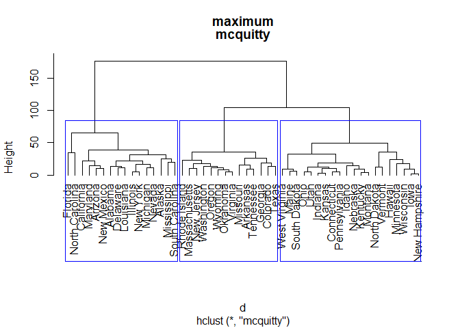
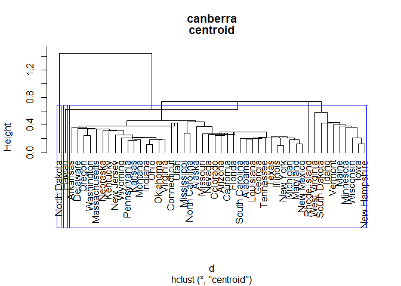

<html>
<h2 style={font-family: "XB Niloofar">
Statistical Computing
</h2>
<h3 style={font-family: "XB Niloofar">
Author <br>
Amirhossein Khadivi <br>
<a href='https://github.com/amirhossein-khadivi/SC/tree/master'title='GitHub'>Source Codes</a>
<br><br>
Supervisor <br>
Dr. Mohammad Kazemi <br> <br>
Department of Statistics, University of Guilan
<br>
</h3>

<p>

<br>

``` r
library(mnormt)
```

<br><br>

۱- میخواهیم ۱۰۰ بردار تصادفی از توزیع نرمال ۵ متغیره با بردار میانگین و
ماتریس کوواریانسی که در سلول برنامه زیر ذخیره شده است تولید کنیم و سپس
بردار میانگین و ماتریس کوواریانس آنها را محاسبه کنیم.

``` r
mu <- c(80, 75, 55, 62, 73)
sigm <-
  matrix(c(
    5,
    0,
    0,
    -0.5,
    0.1,
    0,
    7,
    1,
    0,
    0,
    0,
    1,
    9,
    0.1,
    0,
    -0.5,
    0,
    0.1,
    7,
    0,
    0.1,
    0,
    0,
    0,
    8
  ),
  5)
x <- rmnorm(100, mu, sigm)
as.data.frame(round(x, digits = 2))
```

    ##        V1    V2    V3    V4    V5
    ## 1   77.02 76.75 55.10 59.49 73.32
    ## 2   80.90 75.81 52.13 62.63 72.62
    ## 3   81.42 74.86 55.73 61.11 72.96
    ## 4   77.27 73.73 59.44 65.42 74.21
    ## 5   83.83 79.02 55.54 58.95 70.18
    ## 6   79.51 74.39 57.84 61.71 70.70
    ## 7   83.85 75.02 52.61 59.11 71.69
    ## 8   79.32 75.69 57.80 60.36 77.36
    ## 9   81.95 78.17 52.88 62.20 70.52
    ## 10  78.28 77.24 52.93 67.37 73.03
    ## 11  81.58 73.42 55.58 61.25 77.39
    ## 12  78.50 75.94 56.46 67.84 76.87
    ## 13  80.31 71.44 53.23 62.16 69.64
    ## 14  80.92 76.75 55.57 54.36 72.58
    ## 15  78.52 74.46 55.25 59.88 74.22
    ## 16  80.74 76.84 59.22 58.79 68.78
    ## 17  78.62 77.96 56.92 58.41 73.11
    ## 18  79.43 70.69 55.58 63.78 72.36
    ## 19  80.88 68.23 53.70 60.78 70.49
    ## 20  78.51 69.91 56.27 63.85 66.59
    ## 21  81.27 71.93 55.24 60.58 75.15
    ## 22  82.48 77.55 56.58 60.15 74.77
    ## 23  79.00 77.55 52.09 60.17 70.46
    ## 24  76.62 74.36 55.10 61.61 70.50
    ## 25  80.76 72.20 56.53 60.12 71.74
    ## 26  81.45 76.23 51.67 60.73 75.89
    ## 27  79.73 75.13 58.38 66.04 69.46
    ## 28  76.59 77.78 55.86 56.83 72.95
    ## 29  82.95 78.15 58.91 59.08 71.01
    ## 30  80.36 72.65 52.85 61.29 76.59
    ## 31  75.14 70.99 51.26 66.87 72.51
    ## 32  81.85 70.85 52.30 61.60 75.05
    ## 33  82.09 76.85 54.14 61.26 69.73
    ## 34  79.29 73.00 55.03 61.85 71.67
    ## 35  82.57 76.98 53.45 62.46 70.38
    ## 36  78.54 79.25 59.69 61.20 68.20
    ## 37  77.97 76.54 58.42 63.00 74.64
    ## 38  82.53 71.77 52.48 62.60 71.91
    ## 39  78.41 73.65 53.37 62.48 74.64
    ## 40  79.75 73.08 55.65 61.87 70.41
    ## 41  83.84 72.37 50.03 63.32 71.85
    ## 42  82.35 77.26 58.95 60.24 71.91
    ## 43  79.16 74.88 49.18 64.39 71.14
    ## 44  75.95 73.56 54.55 63.34 72.80
    ## 45  77.11 75.45 52.20 58.18 77.59
    ## 46  79.96 79.69 56.10 60.00 69.25
    ## 47  78.72 78.07 57.86 59.94 70.71
    ## 48  77.04 73.05 52.99 63.38 71.13
    ## 49  78.45 77.24 60.19 62.04 76.18
    ## 50  83.97 74.00 54.59 65.87 76.29
    ## 51  81.69 74.09 53.04 59.40 75.01
    ## 52  78.41 71.86 51.19 60.04 73.72
    ## 53  81.89 73.25 53.69 61.85 73.98
    ## 54  79.95 73.26 52.79 59.91 76.60
    ## 55  77.39 76.43 58.17 62.23 68.63
    ## 56  81.46 75.14 55.74 58.66 72.54
    ## 57  76.41 79.02 51.48 60.63 70.43
    ## 58  79.34 74.64 55.11 63.96 72.96
    ## 59  80.29 76.29 52.75 60.04 69.51
    ## 60  79.88 76.07 59.16 58.99 72.18
    ## 61  81.31 74.34 56.38 60.14 66.19
    ## 62  80.20 71.11 58.87 56.15 73.76
    ## 63  77.90 75.36 58.92 59.72 74.34
    ## 64  79.25 78.26 50.00 65.05 77.10
    ## 65  81.41 75.78 55.01 57.26 75.28
    ## 66  80.68 78.42 62.45 63.65 67.52
    ## 67  83.75 74.56 58.61 59.25 73.66
    ## 68  83.53 73.63 55.26 58.64 70.23
    ## 69  81.40 77.08 56.15 63.16 73.70
    ## 70  80.57 78.00 57.70 61.66 68.80
    ## 71  80.98 76.47 52.99 63.49 72.21
    ## 72  82.85 73.14 55.34 63.64 76.59
    ## 73  81.64 75.33 55.34 61.98 74.07
    ## 74  78.95 72.07 57.22 64.55 71.06
    ## 75  77.35 75.67 50.06 63.20 69.66
    ## 76  78.81 74.38 55.95 60.25 74.12
    ## 77  78.14 74.56 52.63 61.51 74.37
    ## 78  75.12 79.41 55.63 59.13 79.33
    ## 79  81.72 74.28 54.84 59.66 73.05
    ## 80  81.09 73.99 59.73 61.13 73.59
    ## 81  80.46 75.84 52.07 60.27 72.33
    ## 82  80.45 74.26 59.04 61.10 71.42
    ## 83  82.10 78.22 56.86 61.87 78.34
    ## 84  80.59 75.31 54.99 66.11 67.40
    ## 85  79.46 70.78 52.81 64.26 73.41
    ## 86  80.50 75.90 48.14 61.38 78.42
    ## 87  83.96 76.05 56.80 60.79 77.80
    ## 88  81.06 73.82 59.52 59.75 71.11
    ## 89  81.65 78.23 55.71 61.70 74.43
    ## 90  82.21 77.40 55.10 60.99 72.47
    ## 91  77.50 71.87 57.13 64.59 73.45
    ## 92  80.22 74.95 54.04 62.03 75.14
    ## 93  79.92 73.53 54.29 64.75 73.86
    ## 94  80.80 73.51 57.57 67.14 75.16
    ## 95  83.56 76.57 59.39 58.67 73.25
    ## 96  82.33 71.20 53.72 60.62 73.91
    ## 97  82.02 78.03 57.25 61.16 68.47
    ## 98  78.74 77.50 59.42 62.79 75.04
    ## 99  81.38 72.70 60.24 60.77 72.33
    ## 100 80.16 79.47 58.56 65.19 69.81

``` r
mu1 <- round(apply(x, 2, mean), digits = 2)
sigm1 <- round(var(x), digits = 2)
cat('Mean Vector: ')
```

    ## Mean Vector:

``` r
print(mu1)
```

    ## [1] 80.20 75.09 55.40 61.57 72.77

``` r
print('Cov MAtrix: ')
```

    ## [1] "Cov MAtrix: "

``` r
print(sigm1)
```

    ##       [,1]  [,2]  [,3]  [,4]  [,5]
    ## [1,]  4.26 -0.02  0.33 -0.97 -0.05
    ## [2,] -0.02  6.05  1.44 -1.04 -0.40
    ## [3,]  0.33  1.44  7.99 -0.88 -1.30
    ## [4,] -0.97 -1.04 -0.88  6.03 -0.22
    ## [5,] -0.05 -0.40 -1.30 -0.22  7.73

<br><br>

۲- میخواهیم مقدار انتگرال یک چگالی از توزیع نرمال دو متغیره که بردار
میانگین و ماتریس کوواریانس آن در سلول برنامه زیر ذخیره شده است را به
ازای x های از -۲.۵ تا ۱ و y های از منهای بی نهایت تا ۰.۲ را محاسبه کنیم.

``` r
m <- c(0, 0)
s <- matrix(c(1, 0.5, 0.5, 1), 2)
sadmvn(c(-Inf, -2.5), c(0.2, 1), m, s)
```

    ## [1] 0.5311862

<br><br>

۳- می خواهیم تحلیل مولفه های اصلی را برای داده هایی که در سلول برنامه
زیر با عنوان mydata ذخیره کرده ایم انجام دهیم.

``` r
a <- matrix(c(5, 8, -6, 0, 0, 7, 9, 0.5), ncol = 2)
p <- cbind(rexp(100, 1), rnorm(100, 0, 0.5))
mydata <- matrix(NA, ncol = 4, nrow = 100)

for (i in 1:100) {
  mydata[i, ] <- c(a %*% p[i, ])
}
mydata <- as.data.frame(mydata)
mydata
```

    ##               V1          V2            V3            V4
    ## 1    3.300021495 -0.48052061 -11.366453649 -4.114682e-01
    ## 2    2.549696837  5.04436179  -1.819118831  6.891763e-02
    ## 3    8.827353203 14.36417720 -10.283722604  1.717229e-02
    ## 4    0.544766134  8.52038718   9.180402393  5.463401e-01
    ## 5    0.100165842 -7.65415015 -10.167304649 -5.581725e-01
    ## 6    3.185229590 11.30322191   4.157966077  4.433468e-01
    ## 7    1.706760773 -5.46021415 -12.579438997 -5.850737e-01
    ## 8    1.539645428  1.27793047  -3.371791645 -8.467873e-02
    ## 9    5.422427177  4.86521995 -11.406337150 -2.721903e-01
    ## 10   3.815408784  9.83345823   0.215686253  2.663432e-01
    ## 11  17.370456301 24.44002683 -25.155166029 -2.394788e-01
    ## 12   3.462707740  8.75813601  -0.018073203  2.298431e-01
    ## 13   1.077275505 -7.27544635 -12.862985529 -6.427919e-01
    ## 14   2.416862133 11.92841314   7.464465953  5.758167e-01
    ## 15   1.388805395 -2.16898619  -7.312234101 -3.136482e-01
    ## 16   0.269036631  1.09826527   0.535764603  4.770048e-02
    ## 17   2.489205411  2.77531231  -4.539438934 -8.624402e-02
    ## 18   7.994454689 17.94086700  -2.972251983  3.678385e-01
    ## 19   0.001306594  2.39854838   3.079592156  1.711756e-01
    ## 20   1.065750243  0.36347029  -3.003981848 -9.583786e-02
    ## 21  13.632340365 23.46269858 -14.236153303  1.179253e-01
    ## 22   0.977648436 -2.08619495  -5.866591272 -2.607452e-01
    ## 23  17.131521887 25.49902319 -23.015355755 -1.365294e-01
    ## 24  10.265263170 15.11406075 -14.003064792 -9.359717e-02
    ## 25   2.631873447  0.23114276  -8.275204249 -2.842753e-01
    ## 26   1.761106688  4.46752555   0.007785357  1.178396e-01
    ## 27  10.730325587 19.32528522 -10.103408058  1.540546e-01
    ## 28   7.423961572 16.77547283  -2.612438343  3.497953e-01
    ## 29   0.361624402  3.12557325   2.840731838  1.819267e-01
    ## 30  10.696990910 16.32319072 -13.854668041 -5.657105e-02
    ## 31   3.728150646 10.76011407   1.691313127  3.425052e-01
    ## 32   7.037401832  7.46458234 -13.324502957 -2.710900e-01
    ## 33   5.443098695  7.03043567  -8.689818459 -1.198944e-01
    ## 34   2.285701982 -0.59108874  -8.204829125 -3.034437e-01
    ## 35  12.147954357 21.70908386 -11.655943512  1.623112e-01
    ## 36   1.559603849  1.03028233  -3.755203823 -1.046488e-01
    ## 37  15.260514108 28.35351907 -13.251150006  2.811926e-01
    ## 38   0.177261208  1.10682798   0.845699464  5.880072e-02
    ## 39   8.627046197 15.36966576  -8.338523067  1.118851e-01
    ## 40   3.232169924  5.74427038  -3.142148691  4.091418e-02
    ## 41  11.118017926 19.48931648 -11.155280049  1.214634e-01
    ## 42   3.207164318  3.24728386  -6.271113099 -1.345842e-01
    ## 43   4.712758641  2.40550125 -12.257340821 -3.667795e-01
    ## 44   7.180351913 13.28338525  -6.308793771  1.282016e-01
    ## 45   2.267587995  6.92117877   1.512800381  2.352170e-01
    ## 46   4.519219366  7.45813847  -5.130707901  1.624196e-02
    ## 47   5.106437825 12.59823657  -0.434664761  3.162811e-01
    ## 48   3.326013715  5.32189414  -3.990866490  1.944265e-05
    ## 49   1.172388049  5.81722386   3.660652465  2.815288e-01
    ## 50   4.256663425  5.74011065  -6.484418603 -7.646792e-02
    ## 51   4.837560016  8.45764069  -4.882514596  5.125319e-02
    ## 52   0.868939691  5.58509803   4.350579611  2.996282e-01
    ## 53   7.134454626 13.59429686  -5.759556247  1.556550e-01
    ## 54   7.168129906  7.26916148 -14.001558363 -2.999890e-01
    ## 55   2.589029051  4.22939513  -2.995043748  6.210617e-03
    ## 56  10.159286474 16.70498059 -11.612415185  3.215159e-02
    ## 57  19.644556221 34.81885111 -19.218031700  2.419687e-01
    ## 58   8.190150428 10.42134866 -13.277613113 -1.916351e-01
    ## 59   5.725104249  5.99691317 -10.937165482 -2.259467e-01
    ## 60   1.780889053  6.03255831   1.955536342  2.273668e-01
    ## 61   6.755618467 13.89752673  -4.135765781  2.206098e-01
    ## 62  11.119596281 13.44203718 -18.935494372 -3.106655e-01
    ## 63  10.095678325 17.38222255 -10.534494694  8.779552e-02
    ## 64   6.255727489 12.54048189  -4.252321399  1.808084e-01
    ## 65   3.211142977  8.30182668   0.214625750  2.259999e-01
    ## 66   2.690919184  3.33995138  -4.470484992 -6.896567e-02
    ## 67   1.246206660  4.83673491   2.159586052  2.030574e-01
    ## 68   8.162975739 22.52426765   2.371794571  6.759647e-01
    ## 69   7.319246120  9.89776672 -11.114130158 -1.295019e-01
    ## 70   4.748790050 11.81614335  -0.275303284  3.012914e-01
    ## 71   9.833338614 15.87763940 -11.614480830  1.030697e-02
    ## 72   2.634776232  0.07992467  -8.479082289 -2.954084e-01
    ## 73   8.180044479 12.32425345 -10.798104720 -5.455841e-02
    ## 74   0.918486589 -0.32844564  -3.413929282 -1.284303e-01
    ## 75   1.258439524  2.80341027  -0.494532670  5.642193e-02
    ## 76   5.020832326  2.72948817 -12.844226220 -3.788460e-01
    ## 77   2.364455725  5.58832738  -0.516377725  1.289427e-01
    ## 78   1.092183795 -5.60499506 -10.763820867 -5.251778e-01
    ## 79   5.099551528  9.53796321  -4.346872278  9.847720e-02
    ## 80   3.738530237  7.26911675  -2.830919813  9.196203e-02
    ## 81   5.155076709  8.85026923  -5.411903704  4.301046e-02
    ## 82   1.631773293  3.02319388  -1.427955172  2.945404e-02
    ## 83   1.664106469  1.31134100  -3.734222644 -9.651638e-02
    ## 84   3.298421083  8.82579877   0.604026896  2.534518e-01
    ## 85   3.145329009  4.35233179  -4.648930762 -4.858533e-02
    ## 86   0.036079738  8.94890714  11.388220896  6.350843e-01
    ## 87   2.782798179 11.42357557   5.623483092  4.979356e-01
    ## 88   5.882365541  7.47475978  -9.549299466 -1.383589e-01
    ## 89   0.173665801 -2.04264424  -3.191911200 -1.657507e-01
    ## 90   7.905851388 11.91734234 -10.428190083 -5.228713e-02
    ## 91  10.381504651 17.98240328 -10.693810927  9.799970e-02
    ## 92   1.846095041 -2.50223619  -9.230156100 -3.897134e-01
    ## 93   3.232872065  7.14913093  -1.338186387  1.411811e-01
    ## 94   5.378263108  8.95964710  -5.998224991  2.531615e-02
    ## 95   2.482025078 -4.64291331 -14.053770224 -6.152967e-01
    ## 96   5.391976088  6.37574653  -9.365048008 -1.608154e-01
    ## 97   1.091241467  0.04906382  -3.491247292 -1.212088e-01
    ## 98   2.910839863  4.26316682  -3.999806782 -2.815550e-02
    ## 99   4.415087603  5.15018546  -7.758904026 -1.367111e-01
    ## 100  2.189156802  1.26955453  -5.498112050 -1.595069e-01

<br> مولفه های اصلی را بر اساس ماتریس همبستگی محاسه می کنیم.

``` r
mp <- princomp(mydata, cor = T, scores = T)
summary(mp)
```

    ## Importance of components:
    ##                          Comp.1   Comp.2       Comp.3 Comp.4
    ## Standard deviation     1.501812 1.320818 2.588627e-08      0
    ## Proportion of Variance 0.563860 0.436140 1.675247e-16      0
    ## Cumulative Proportion  0.563860 1.000000 1.000000e+00      1

نتایج فوق حاکی از اینست که تمام واریانس چهار متغیرمان توسط دو مولفه اول
بیان می شود.پس با خلاصه کردن ۴ متغیر در ۲ مولفه واریانسی را از دست
نخواهیم داد.

<br><br> حال می خواهیم بارهای عاملی را بررسی کنیم.

``` r
mp$loadings
```

    ## 
    ## Loadings:
    ##    Comp.1 Comp.2 Comp.3 Comp.4
    ## V1  0.666         0.725  0.174
    ## V2  0.588 -0.354 -0.626  0.369
    ## V3 -0.455 -0.553  0.266  0.645
    ## V4        -0.754  0.104 -0.646
    ## 
    ##                Comp.1 Comp.2 Comp.3 Comp.4
    ## SS loadings      1.00   1.00   1.00   1.00
    ## Proportion Var   0.25   0.25   0.25   0.25
    ## Cumulative Var   0.25   0.50   0.75   1.00

با توجه به بررسی سلول برنامه قبل مشاهده شده دو مولفه اول به تنهایی کل
واریانس را پوشش می دهند ، پس در بررسی بارهای عاملی نیز فقط دو مولفه
اول را مورد بررسی قرار میدهیم. <br> از مولفه اول مشخص است که یک مقابله
ضعیف بین دو متغیر اول با دو متغیر دوم بیان میکند. <br> از مشاهده ضریب
های مولفه دوم مشاهده می شود که رابطه ی مستقیم بین ۴ متغیر و مولفه دوم
وجود دارد به طوریکه با افزایش یا کاهش مقدار سه متغیر دوم و تا حدی متغیر
اول مولفه دوم افزایش یا کاهش پیدا میکند. <br> <br>

در نهایت نمودار پراکنش داده ها را بر اساس دو مولفه اول رسم میکنیم.

``` r
biplot(mp)
```

<!-- --> <br>

هر نقطه در نمودار نشانگر یکی از داه ها است که موقعیت طول آن مقدار مولفه
اولش و عرض آن مقدار مولفه دومش را مشخص می کند. همچنین موقعیت هر مشاهده
نسبت به هر متغیر را بر اساس بردار متغیر موجود در نمودار می سنجیم ، به
عنوان مثال اگر بردار متغیر چهارم را ادامه دهیم متوجه می شویم که ۷۴امین
مشاهده دارای بیشترین مقدار از متغیر چهارم است و همچنین اگر بردار مربوط
به متغیر سوم را ادامه دهیم مشاهده میشود که مشاهده ی ۱۷ام دارای کمترین
مقدار از متغیر سوم است. <br> جهت بردارها ارتباط آنها با مولفه را نشان
میدهد. به عنوان مثال متغیرهای اول و سوم ارتباط بیشتری با مولفه اول
دارند تا متغیرهای دوم و چهارم. <br> همچنین جهت بردارها و زاویه میان
آنها همبستگی بین متغیرها را نشان میدهد. به عنوان مثال متغیرهای اول و
چهارم کمترین همبستگی و متغیرهای اول و دوم بیشترین همبستگی را دارند ،
همچنین برای مثال متغیرهای اول و سوم همبستگی منفی دارند. این اطلاعات را
ماتریس همبستگی که در سلول برنامه زیر آمده است نیز تایید میکند.

``` r
cor(mydata)
```

    ##             V1         V2         V3         V4
    ## V1  1.00000000  0.8804612 -0.6876503 0.08567784
    ## V2  0.88046120  1.0000000 -0.2612197 0.54781084
    ## V3 -0.68765031 -0.2612197  1.0000000 0.66445592
    ## V4  0.08567784  0.5478108  0.6644559 1.00000000

<br><br><br>

۴-میخواهیم خوشه بندی سلسله مراتبی را برای داده های USArrests انجام دهیم.

``` r
USArrests
```

    ##                Murder Assault UrbanPop Rape
    ## Alabama          13.2     236       58 21.2
    ## Alaska           10.0     263       48 44.5
    ## Arizona           8.1     294       80 31.0
    ## Arkansas          8.8     190       50 19.5
    ## California        9.0     276       91 40.6
    ## Colorado          7.9     204       78 38.7
    ## Connecticut       3.3     110       77 11.1
    ## Delaware          5.9     238       72 15.8
    ## Florida          15.4     335       80 31.9
    ## Georgia          17.4     211       60 25.8
    ## Hawaii            5.3      46       83 20.2
    ## Idaho             2.6     120       54 14.2
    ## Illinois         10.4     249       83 24.0
    ## Indiana           7.2     113       65 21.0
    ## Iowa              2.2      56       57 11.3
    ## Kansas            6.0     115       66 18.0
    ## Kentucky          9.7     109       52 16.3
    ## Louisiana        15.4     249       66 22.2
    ## Maine             2.1      83       51  7.8
    ## Maryland         11.3     300       67 27.8
    ## Massachusetts     4.4     149       85 16.3
    ## Michigan         12.1     255       74 35.1
    ## Minnesota         2.7      72       66 14.9
    ## Mississippi      16.1     259       44 17.1
    ## Missouri          9.0     178       70 28.2
    ## Montana           6.0     109       53 16.4
    ## Nebraska          4.3     102       62 16.5
    ## Nevada           12.2     252       81 46.0
    ## New Hampshire     2.1      57       56  9.5
    ## New Jersey        7.4     159       89 18.8
    ## New Mexico       11.4     285       70 32.1
    ## New York         11.1     254       86 26.1
    ## North Carolina   13.0     337       45 16.1
    ## North Dakota      0.8      45       44  7.3
    ## Ohio              7.3     120       75 21.4
    ## Oklahoma          6.6     151       68 20.0
    ## Oregon            4.9     159       67 29.3
    ## Pennsylvania      6.3     106       72 14.9
    ## Rhode Island      3.4     174       87  8.3
    ## South Carolina   14.4     279       48 22.5
    ## South Dakota      3.8      86       45 12.8
    ## Tennessee        13.2     188       59 26.9
    ## Texas            12.7     201       80 25.5
    ## Utah              3.2     120       80 22.9
    ## Vermont           2.2      48       32 11.2
    ## Virginia          8.5     156       63 20.7
    ## Washington        4.0     145       73 26.2
    ## West Virginia     5.7      81       39  9.3
    ## Wisconsin         2.6      53       66 10.8
    ## Wyoming           6.8     161       60 15.6

<br><br>

۳۰ مدل خوشه بندی را با توجه به تمام روش های یافتن فاصله و خوشه بندی
سلسله مراتبی که در توابع آن ها در R موجود است در سلول کد زیر انجام
میدهیم. <br> همچنین برای مقایسه های دیداری روش ها با هم نمودار
دندروگرام آن ها را رسم کرده و تعداد خوشه ی ۳ را به عنوان یک
نمونه برای مقایسه در نر می گیریم.

``` r
methodh <-
  c('single',
    'complete',
    'average',
    'mcquitty',
    'median',
    'centroid')
methodd <-
  c('euclidean', 'maximum', 'manhattan', 'canberra', 'minkowski')
for (i in 1:5) {
  for (j in 1:6) {
    d <- dist(USArrests, method = methodd[i])
    h <- hclust(d, method = methodh[j])
    plot(h, hang = -1, main = c(methodd[i], methodh[j]))
    rect.hclust(h, k = 3, border = 'blue')
  }
}
```

<!-- --><!-- --><!-- --><!-- --><!-- --><!-- --><!-- --><!-- --><!-- --><!-- --><!-- --><!-- --><!-- --><!-- --><!-- --><!-- --><!-- --><!-- --><!-- --><!-- --><!-- --><!-- --><!-- --><!-- --><!-- --><!-- --><!-- --><!-- --><!-- --><!-- -->

</p>

</body>

</html>
