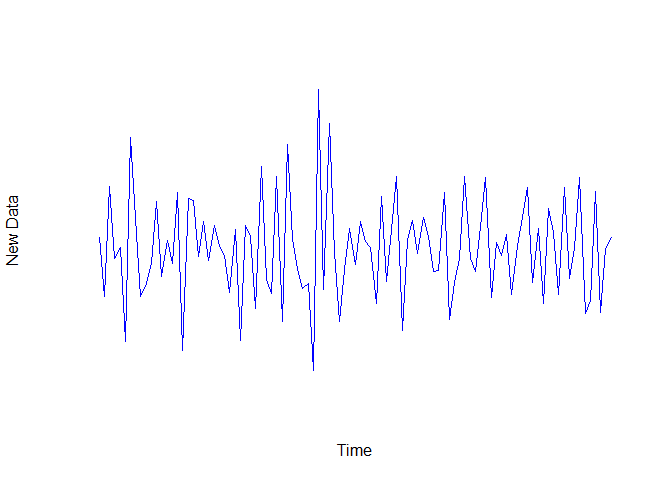

<html>
  <h2 style={font-family: "XB Niloofar">
Statistical Computing
</h2>
<h3 style={font-family: "XB Niloofar">
Author <br>
Amirhossein Khadivi <br>
<a href='https://github.com/amirhossein-khadivi/SC/tree/master'title='GitHub'>Source Codes</a>
<br><br>
Supervisor <br>
Dr. Mohammad Kazemi <br> <br>
Department of Statistics, University of Guilan
<br>
</h3>

<p>

<br>

``` r
library(dplyr)
library(MASS)
library(bayesforecast)
library(car)
library(nortest)
```

<br><br>

۱- داده های میزان مصرف سه ماهه ی گاز طبیعی بریتانیا از سه ماهه نخست ۱۹۶۰
تا سه ماهه ی پایانی ۱۹۸۶ را که در R موجود است فراخوانی می کنیم.

``` r
UKgas
```

    ##        Qtr1   Qtr2   Qtr3   Qtr4
    ## 1960  160.1  129.7   84.8  120.1
    ## 1961  160.1  124.9   84.8  116.9
    ## 1962  169.7  140.9   89.7  123.3
    ## 1963  187.3  144.1   92.9  120.1
    ## 1964  176.1  147.3   89.7  123.3
    ## 1965  185.7  155.3   99.3  131.3
    ## 1966  200.1  161.7  102.5  136.1
    ## 1967  204.9  176.1  112.1  140.9
    ## 1968  227.3  195.3  115.3  142.5
    ## 1969  244.9  214.5  118.5  153.7
    ## 1970  244.9  216.1  188.9  142.5
    ## 1971  301.0  196.9  136.1  267.3
    ## 1972  317.0  230.5  152.1  336.2
    ## 1973  371.4  240.1  158.5  355.4
    ## 1974  449.9  286.6  179.3  403.4
    ## 1975  491.5  321.8  177.7  409.8
    ## 1976  593.9  329.8  176.1  483.5
    ## 1977  584.3  395.4  187.3  485.1
    ## 1978  669.2  421.0  216.1  509.1
    ## 1979  827.7  467.5  209.7  542.7
    ## 1980  840.5  414.6  217.7  670.8
    ## 1981  848.5  437.0  209.7  701.2
    ## 1982  925.3  443.4  214.5  683.6
    ## 1983  917.3  515.5  224.1  694.8
    ## 1984  989.4  477.1  233.7  730.0
    ## 1985 1087.0  534.7  281.8  787.6
    ## 1986 1163.9  613.1  347.4  782.8

حال می خواهیم در صورت وجود نامانایی در میانگین و واریانس تبدیلات لازم را
برای مانا کردن داده ها انجام دهیم.

<br><br>

``` r
UKgas %>% plot(col = 'blue', axes = F)
```

<!-- --> <br> با توجه به
نمودار خطی داده ها هم نامانایی در میانگین و هم نامانایی در واریانس
مشاهده می شود.

<br>

``` r
UKgas %>% ggacf()
```

<!-- -->

``` r
UKgas %>% ggpacf()
```

<!-- --> <br> با توجه به
اینکه لگ ها در نمودارهای خودهمبستگی و خودهمبستگی جزیی با سرعت ضعیف به
صفر میل می کنند بنابراین تاییدی دیگر برای نامانایی در داده ها به دست
می آوریم.

<br><br>

``` r
UKgas %>% diff() %>% plot(col = 'blue', axes = F, ylab = 'Diff(UKgas,1)')
```

<!-- --> <br> با تفاضلی
کردن مرتبه اول داده ها مشاهده می شود که نامانایی در میانگین کنترل می
شود و داده ها در میانگین مانا می شوند.

<br><br>

برای تثبیت نامانایی در واریانس از تبدیل باکس کاکس استفاده می کنیم،
میدانیم که تبدیل باکس کاکس را فقط روی داده های مثبت به کار برد
بنابراین باید بررسی کنیم که داده ی منفی نداشته باشیم. <br> البته با
توجه به ماهیت داده ها که مصرف گاز در یک کشور است بنابراین امکان وجود
داده های نامثبت وجود ندارد ولی با این حال این موضوع را بررسی می کنیم
که مشاهده می شود هیچ داده ی نامثبتی وجود ندارد.

``` r
y <- 0
for (i in 1:length(UKgas)) {
  if (UKgas[i] <= 0)
    y <- y + 1
}
cat('Non-positive data Numbe: ', y)
```

    ## Non-positive data Numbe:  0

<br>

تبدیل باکس کاکس را انجام می دهیم با توجه به اینکه فاصله اطمینان لامبدا
صفر را شامل می شود بنابراین برای تثبیت واریانس از داده ها لگاریتم می
گیریم.

``` r
boxcox(UKgas ~ 1)
```

<!-- -->

<br><br>

تبدیل موردنظر را روی داده ها انجام داده و نمودار داده های جدید را رسم می
کنیم ، مشاهده می شود که نامانایی در واریانس نیز تثبیت شده است.

``` r
nukgas <- UKgas %>% log()
nukgas %>% diff() %>% plot(axes = F, col = 'blue', ylab = 'New Data')
```

<!-- -->

<br><br>

``` r
nukgas %>% diff() %>% ggacf()
```

<!-- -->

``` r
nukgas %>% diff() %>% ggpacf()
```

<!-- --> <br> با توجه به
اینکه لگ های نمودارهای خودهمبستگی و خودهمبستگی جزیی با سرعت زیادی به
صفر میل می کند تاییدی دیگر برای مانایی داده ها میگیریم. البته در
نمودار خودهمبستگی مشاهده می شود که تعدادی از لگ ها متنابا بیرون از
فاصله اطمینان خود هستند که این مانایی را خدشه دار نمی کند و صرف نشات از
یک الگوی فصلی در داده ها دارد.

<br><br>

۲,۳ - می خواهیم برای داده های مذکور بعد از تبدیلاتی که انجام دادیم مدلی
مناسب برازش دهیم. <br> با توجه به نمودارهای خودهمبستگی و خودهمبستگی
جزیی سه مدل MA(2) , SARIMA(0,1,0)(0,0,1);s=4 ,
SARIMA(0,1,2)(0,0,1);s=4 را به مدل برازش می دهیم. همچنین برای ضرایب هر
سه مدل فاصله اطمینان ۹۵درصدی به دست می آوریم که چون هیچ کدام صفر را
شامل نمی شود بنابراین در سطح معناداری ۰.۰۵ عدم الزام حضور این ضرایب
در مدل تایید نمی شود.

``` r
modell <- list(
  model1 = nukgas %>% arima(order = c(0, 1, 2))
  ,
  model2 = nukgas %>% arima(
    order = c(0, 1, 0),
    seasonal = list(order = c(0, 0, 1), period = 4)
  ),
  model3 = nukgas %>% arima(
    order = c(0, 1, 2),
    seasonal = list(order = c(0, 0, 1), period = 4)
  )
)
confidence <-
  list(
    model1 = modell$model1 %>% confint(),
    model2 = modell$model2 %>% confint(),
    model3 = modell$model3 %>% confint()
  )
confidence
```

    ## $model1
    ##          2.5 %     97.5 %
    ## ma1 -0.5024376 -0.2215602
    ## ma2 -0.5936068 -0.3376980
    ## 
    ## $model2
    ##          2.5 %    97.5 %
    ## sma1 0.6991958 0.8962772
    ## 
    ## $model3
    ##           2.5 %     97.5 %
    ## ma1  -0.6239100 -0.2159187
    ## ma2  -0.6170732 -0.2328041
    ## sma1  0.6864101  0.8881985

<br><br> حال به بررسی کفایت مدل ها میپردازیم. <br><br>

مشاهده می شود که میانگین مانده های هر سه مدل نزدیک صفر هستند.

``` r
meanm <- list(
  model1 = modell$model1$residuals %>% mean(),
  model2 = modell$model2$residuals %>% mean(),
  model3 = modell$model3$residuals %>% mean()
)
meanm
```

    ## $model1
    ## [1] 0.0795919
    ## 
    ## $model2
    ## [1] 0.008155321
    ## 
    ## $model3
    ## [1] 0.0493723

<br><br>

``` r
list(
    modell$model1$residuals %>% as.vector() %>% durbinWatsonTest() -> dw1
    ,
    modell$model2$residuals %>% as.vector() %>% durbinWatsonTest() -> dw2
    ,
    modell$model3$residuals %>% as.vector() %>% durbinWatsonTest() -> dw3
  ) -> DW
DW
```

    ## [[1]]
    ## [1] 2.229608
    ## 
    ## [[2]]
    ## [1] 2.354027
    ## 
    ## [[3]]
    ## [1] 2.347988

با استفاده از آزمون دوربین واتسون همبستگی مانده ها را بررسی می کنیم.
<br> با توجه به اینکه مقدار آماره دوربین واتسون برای هر سه مدل در بازه
۱.۵ تا ۲.۵ قرار دارد ، بنابراین فرض ناهمبسته بودن مدل تایید می شود.

<br><br>

``` r
normality <- list(
  model1 = c(
    shapiro.test(modell$model1$residuals)$p.value,
    ks.test(
      modell$model1$residuals,
      modell$model1$residuals %>% mean(),
      modell$model1$residuals %>% sd()
    )$p.value,
    ad.test(modell$model1$residuals)$p.value,
    lillie.test(modell$model1$residuals)$p.value
  ),
  model2 = c(
    shapiro.test(modell$model2$residuals)$p.value,
    ks.test(
      modell$model2$residuals,
      modell$model2$residuals %>% mean(),
      modell$model2$residuals %>% sd()
    )$p.value,
    ad.test(modell$model2$residuals)$p.value,
    lillie.test(modell$model2$residuals)$p.value
  ),
  model3 = c(
    shapiro.test(modell$model3$residuals)$p.value,
    ks.test(
      modell$model3$residuals,
      modell$model3$residuals %>% mean(),
      modell$model3$residuals %>% sd()
    )$p.value,
    ad.test(modell$model3$residuals)$p.value,
    lillie.test(modell$model3$residuals)$p.value
  )
)
normality
```

    ## $model1
    ## [1] 0.07914147 1.00000000 0.24834256 0.27284820
    ## 
    ## $model2
    ## [1] 0.05045848 0.95412844 0.04780745 0.16015933
    ## 
    ## $model3
    ## [1] 0.9123852 0.9908257 0.8549185 0.7168303

برای بررسی فرض نرمال بودن مانده ها نیز از چهار آزمون شاپیروویلک ،
کولموگروف اسمیرنف ، اندرسون دارلینگ و آماره ی اصلاح شده ی
کولموگروف اسمیرنف معروف به لیلیفورس استفاده می کنیم . که با توجه
به پی مقدار آزمون ها نرمال بودن مانده های هر سه مدل تایید می شود.

<br><br>

در نهایت برای بررسی همگنی واریانس مانده ها از نمودار مانده ها در برابر
زمان استفاده می کنیم. <br> با توجه به نمودارها چون الگوی خاصی در
نمودارها دیده نمی شود ، اگر الگویی هم باشد به دلیل اینکه پراکندگی
داده ها حول صفر بسیار کم هست به همین دلیل استدلال مناسبی برای ناهمگن
پنداشتن مانده ها نیست . بنابراین همگنی واریانس مانده های هر سه مدل
تایید می شود.

``` r
modell$model1$residuals %>% plot(
  axes = F ,
  col = 'blue',
  ylab = 'Residuals',
  main = 'Model1'
)
```

<!-- -->

``` r
modell$model2$residuals %>% plot(
  axes = F,
  col = 'blue',
  ylab = 'Residuals',
  main = 'Model2'
)
```

<!-- -->

``` r
modell$model3$residuals %>% plot(
  axes = F,
  col = 'blue',
  ylab = 'Residuals',
  main = 'Model3'
)
```

<!-- --> <br><br>
بنابراین دلیلی برای عدم کفایت مدل ها نداریم پس حال باید با
استفاده از معیار AIC بهترین مدل را از بین این سه مدل پیدا کنیم.

``` r
AICc <- list(
  model1= modell$model1 %>% AIC(),
  model2= modell$model2 %>% AIC(),
  model3= modell$model3 %>% AIC()
)
AICc
```

    ## $model1
    ## [1] 120.2604
    ## 
    ## $model2
    ## [1] 88.37272
    ## 
    ## $model3
    ## [1] 28.12009

با توجه به خروجی فوق مدل سوم چون کمترین مقدار AIC را دارد بنابراین به
عنوان بهترین مدل از بین این سه مدل انتخاب می شود.

<br><br><br>

۴- داده های شدت جریان سالانه ی آب رودخانه ی نیل در نزدیکی شهر اسوان مصر
که برحسب ۱۰۰ میلیون متر مکعب هست از سال ۱۸۷۱ تا ۱۹۷۰ را فراخوانی می
کنیم.. <br> می خواهیم با استفاده از تبدیلات مناسب در صورت الزام یک
مدل سری زمانی مناسب به آن برازش دهیم.

``` r
Nile
```

    ## Time Series:
    ## Start = 1871 
    ## End = 1970 
    ## Frequency = 1 
    ##   [1] 1120 1160  963 1210 1160 1160  813 1230 1370 1140  995  935 1110  994 1020
    ##  [16]  960 1180  799  958 1140 1100 1210 1150 1250 1260 1220 1030 1100  774  840
    ##  [31]  874  694  940  833  701  916  692 1020 1050  969  831  726  456  824  702
    ##  [46] 1120 1100  832  764  821  768  845  864  862  698  845  744  796 1040  759
    ##  [61]  781  865  845  944  984  897  822 1010  771  676  649  846  812  742  801
    ##  [76] 1040  860  874  848  890  744  749  838 1050  918  986  797  923  975  815
    ##  [91] 1020  906  901 1170  912  746  919  718  714  740

<br><br>

برای بررسی مانایی سری نمودار آن را رسم می کنیم که نشان از نامانایی در
میانگین و واریانس دارد.

``` r
Nile %>% plot(col = 'blue', axes = F)
```

<!-- --> <br> لگ های
نمودارهای خودهمبستگی و خودهمبستگی جزیی نیز با سرعت ضعیف به سمت صفر
میل می کنند ک این خود نیز تاییدی دیگر بر نامانایی سری است.

``` r
Nile %>% ggacf()
```

<!-- -->

``` r
Nile %>% ggpacf()
```

<!-- -->

<br><br> برای کنترل نامانایی میانگین داده ها را تفاضلی مرتبه اول می کنیم
که با توجه به نمودار نشانگر تثبیت نامانایی در میانگین است.

``` r
Nile %>% diff() %>% plot(col = 'blue', axes = F, ylab = 'Diff(UKgas,1)')
```

<!-- --> <br><br>

برای تثبیت واریانس نیز از تبدیل باکس کاکس استفاده می کنیم ، می دانیم که
این تبدیل فقط روی داده های مثبت انجام پذیر است بنابراین ابتدا بررسی می
کنیم که در داده هایمان داده ی نامثبت وجود نداشته باشد.

``` r
y <- 0
for (i in 1:length(Nile)) {
  if (Nile[i] <= 0)
    y <- y + 1
}
cat('Non-positive data Numbe: ', y)
```

    ## Non-positive data Numbe:  0

<br> تبدیل باکس کاکس را انجام می دهیم و به این دلیل که بازه اطمینان
لامبدا صفر را هم شامل می شود به این جهت برای تثبیت واریانس از داده
ها لگاریتم طبیعی می گیریم.

``` r
boxcox(Nile ~ 1)
```

<!-- -->

<br><br>

پس از انجام تبدیلات لازم و رسم نمودار سری تبدیل یافته کنترل نامانایی در
نمودار مشاهده می شود.

``` r
Nile %>% log() -> Nile1
Nile1 %>% diff() %>% plot(axes = F, col = 'blue', ylab = 'New Data')
```

<!-- -->

<br>

همچنین ز نمودار خودهمبستگی و خودهمبستگی جزیی سری تبدیل یافته نیز می توان
برای مانایی در میانگین و واریانس تایید گرفت.

``` r
Nile1 %>% diff() %>% ggacf()
```

<!-- -->

``` r
Nile1 %>% diff() %>% ggpacf()
```

<!-- -->

<br> حال باید به دنبال مدلی مناسب برای داده ها بر اساس نمودارهای
خودهمبستگی و خودهمبستگی جزیی باشیم.

<br><br>

با تو جه به نمودارهای خودهمبستگی و خودهمبستگی جزیی سری تبدیل یافته سه
مدل MA(1) , AR(5) , ARMA(1,1) را به سری برازش می دهیم.

``` r
list(
  model1 = Nile1 %>% arima(order = c(0, 1, 1)) ,
  model2 = Nile1 %>% arima(order = c(5, 1, 0)),
  model3 = Nile1 %>% arima(order = c(1, 1, 1))
) -> modeln
list(
  modeln$model1 %>% confint() -> model1 ,
  modeln$model2 %>% confint() -> model2 ,
  modeln$model3 %>% confint() -> model3
) -> confidencen
confidencen
```

    ## [[1]]
    ##          2.5 %     97.5 %
    ## ma1 -0.9727423 -0.5625607
    ## 
    ## [[2]]
    ##          2.5 %      97.5 %
    ## ar1 -0.7863218 -0.40366780
    ## ar2 -0.5726594 -0.14187924
    ## ar3 -0.4909554 -0.04924143
    ## ar4 -0.5348990 -0.10718630
    ## ar5 -0.4099807 -0.02668435
    ## 
    ## [[3]]
    ##            2.5 %     97.5 %
    ## ar1  0.004424108  0.4677623
    ## ma1 -0.992956997 -0.7622852

با توجه به قاصله اطمینان ۹۵ درصدی برای ضرایب که صفر را شامل می شود ، فرض
الزام حضور همه ضرایب هر سه مدل در سطح معناداری ۰.۰۵ تایید می شود.
<br><br> حال به بررسی کفایت مدل ها با تحلیل مانده ها می پردازیم.

``` r
list(
  modeln$model1$residuals %>% mean() -> model1 ,
  modeln$model2$residuals %>% mean() -> model2 ,
  modeln$model3$residuals %>% mean() -> model3
) -> meanmn
meanmn
```

    ## [[1]]
    ## [1] -0.01409959
    ## 
    ## [[2]]
    ## [1] -0.01063045
    ## 
    ## [[3]]
    ## [1] -0.0176434

همانطور که مشاهده می شود میانگین مانده های هر سه مدل نزدیک صفر است.

<br><br>

برای بررسی ناهمبسته بودن مانده ها از آزمون دوربین واتسون استفاده می
کنیم.

``` r
list(
  modeln$model1$residuals %>% as.vector() %>% durbinWatsonTest() -> dw1
  ,
  modeln$model2$residuals %>% as.vector() %>% durbinWatsonTest() -> dw2
  ,
  modeln$model3$residuals %>% as.vector() %>% durbinWatsonTest() -> dw3
) -> DWn
DWn
```

    ## [[1]]
    ## [1] 1.734857
    ## 
    ## [[2]]
    ## [1] 2.021782
    ## 
    ## [[3]]
    ## [1] 2.043167

مشاهده می شود که مقدار آماره دوربیت واتسون برای هر سه مدل در بازه ی ۱.۵
تا ۲.۵ قرار می گیرد که این نشان از تایید فرض ناهمبسته بودن مانده های
مدل ها دارد.

<br><br>

حال برای بررسی فرض نرمال بودن مانده ها نیز همانند مثال قبل از ۴ آزمون
آماری نرمالیتی استفاده می کنیم که پی مقدارهای آزمون ها نشانگر نرمال
بودن مانده های سه مدل ارایه شده است.

``` r
list(
  c(
    shapiro.test(modeln$model1$residuals)$p.value,
    ks.test(
      modeln$model1$residuals,
      modeln$model1$residuals %>% mean,
      modeln$model1$residuals %>% sd
    )$p.value,
    ad.test(modeln$model1$residuals)$p.value,
    lillie.test(modeln$model1$residuals)$p.value
  ) -> model1
  ,
  c(
    shapiro.test(modeln$model2$residuals)$p.value,
    ks.test(
      modeln$model2$residuals,
      modeln$model2$residuals %>% mean,
      modeln$model2$residuals %>% sd
    )$p.value,
    ad.test(modeln$model2$residuals)$p.value,
    lillie.test(modeln$model2$residuals)$p.value
  ) -> model2
  ,
  c(
    shapiro.test(modeln$model3$residuals)$p.value,
    ks.test(
      modeln$model3$residuals,
      modeln$model3$residuals %>% mean,
      modeln$model3$residuals %>% sd
    )$p.value,
    ad.test(modeln$model3$residuals)$p.value,
    lillie.test(modeln$model3$residuals)$p.value
  ) -> model3
) -> normalityn
normalityn
```

    ## [[1]]
    ## [1] 0.1429575 0.8910891 0.2909006 0.1543216
    ## 
    ## [[2]]
    ## [1] 0.8680852 0.9702970 0.9232420 0.8135902
    ## 
    ## [[3]]
    ## [1] 0.12360513 0.89108911 0.30089259 0.09218577

<br><br>

از نمودار مانده ها در برابر زمان نیز فرض صفر بودن میانگین مانده ها مجددا
و فرض همگنی واریانس مانده ها تایید می شود.

``` r
modeln$model1$residuals %>% plot(
  axes = F ,
  col = 'blue',
  ylab = 'Residuals',
  main = 'Model1'
)
```

<!-- -->

``` r
modeln$model2$residuals %>% plot(
  axes = F,
  col = 'blue',
  ylab = 'Residuals',
  main = 'Model2'
)
```

<!-- -->

``` r
modeln$model3$residuals %>% plot(
  axes = F,
  col = 'blue',
  ylab = 'Residuals',
  main = 'Model3'
)
```

<!-- --> <br><br>

بنابراین هیچ دلیلی برای رد کفایت مدل ها نداریم . درنهایت با استفاده از
معیار AIC برای پیدا کردن بهترین مدل از بین این سه مدل استفاده می کنیم.

``` r
list(
  modeln$model1 %>% AIC() -> model,
  modeln$model2 %>% AIC() -> moedl2,
  modeln$model3 %>% AIC() -> model3
) -> AICcn
AICcn
```

    ## [[1]]
    ## [1] -74.59814
    ## 
    ## [[2]]
    ## [1] -68.89957
    ## 
    ## [[3]]
    ## [1] -76.18578

با توجه با خروجی ، مدل سوم یعنی ARMA(1,1) به دلیل داشتن کمترین AIC به
عنوان مدل مطلوب انتخاب می شود.

<br><br><br>

۵- تعداد سالانه ی سیاه گوش های صید شده در منطقه ی رودخانه ی مکنزی کانادا
از سال ۱۸۲۱ تا ۱۹۳۴ را درسلول برنامه زیر فرخوانی کرده ایم و میخواهیم یک
مدل سری زمانی مناسب به آن برازش دهیم.

``` r
lynx
```

    ## Time Series:
    ## Start = 1821 
    ## End = 1934 
    ## Frequency = 1 
    ##   [1]  269  321  585  871 1475 2821 3928 5943 4950 2577  523   98  184  279  409
    ##  [16] 2285 2685 3409 1824  409  151   45   68  213  546 1033 2129 2536  957  361
    ##  [31]  377  225  360  731 1638 2725 2871 2119  684  299  236  245  552 1623 3311
    ##  [46] 6721 4254  687  255  473  358  784 1594 1676 2251 1426  756  299  201  229
    ##  [61]  469  736 2042 2811 4431 2511  389   73   39   49   59  188  377 1292 4031
    ##  [76] 3495  587  105  153  387  758 1307 3465 6991 6313 3794 1836  345  382  808
    ##  [91] 1388 2713 3800 3091 2985 3790  674   81   80  108  229  399 1132 2432 3574
    ## [106] 2935 1537  529  485  662 1000 1590 2657 3396

<br><br>

برای بررسی مانای سری نمودار آن را رسم می کنیم که هم نامانایی در میانگین
و هم نامانایی در واریانس مشاهده می شود.

``` r
lynx %>% plot(axes = F, col = 'blue')
```

<!-- -->

<br>

نمودارهای خودهمبستگی و خودهمبستگی جزیی نیز به دلیل ضعف در سرعت میل کردن
به میل نیز تایید دیگری بر نامانایی سری هستند.

``` r
lynx %>% ggacf
```

<!-- -->

``` r
lynx %>% ggpacf
```

<!-- -->

<br><br>

برای کنترل نامانایی میانگین از تفاضلی مرتبه اول استفاده می کنیم و سپس
نمودار آن را رسم می کنیم که نشانگر مانایی در میانگین سری پس از تفاضلی
کردن مرتبه اول هست.

``` r
lynx %>% diff %>% plot(axes = F, col = 'blue', ylab = 'Diff(lynx,1)')
```

<!-- -->

<br><br>

برای کنترل نامانایی واریانس نیز از تبدیل باکس کاکس استفاده می کنیم که با
توجه به توضیحاتی که در مثال های قبل گفته شد ابتدا عدم وجود داده ی نامثبت
را بررسی می کنیم.

``` r
y <- 0
for (i in 1:length(lynx)) {
  if (lynx[i] <= 0)
    y <- y + 1
}
cat('Non-positive data Numbe: ', y)
```

    ## Non-positive data Numbe:  0

<br>

با توجه به تبدیل باکس کاکس و مطالبی که قبلا بیان شد برای تثبیت واریانس
از داده هایمان لگاریتم طبیعی می گیریم.

``` r
boxcox(lynx ~ 1)
```

<!-- -->

<br><br>

پس از انجام تبدیلات و رسم نمودار سری تبدیل یافته مانایی در سری جدید
مشاهده می شود.

``` r
lynx %>% log -> lynx1
lynx1 %>% plot(axes = F, ylab = 'New Data', col = 'blue')
```

<!-- -->

<br>

نمودارهای خودهمبستگی و خودهمبستگی جزیی نیز تایید دیگری بر مانایی سری
تبدیل یافته دارند.

``` r
lynx1 %>% ggacf
```

<!-- -->

``` r
lynx1 %>% ggpacf
```

<!-- -->

<br><br> حال با استفاده از نمودارهای خودهمبستگی و خودهمبستگی جزیی می
خواهیم مدلی مناسب به داده ها برازش دهیم. <br> پنج مدل AR(2) ,
SARIMA(1,1,0)(1,0,1);s=4 , MA(1) , SARIMA(0,1,2)(0,0,1);s=5 ,
SARIMA(2,1,0)(0,0,2);s=5 را به سری برازش می دهیم.

``` r
list(
  model1 = lynx1 %>%  arima(order = c(2, 1, 0)) ,
  model2 = lynx1 %>% arima(
    order = c(1, 1, 0),
    seasonal = list(order = c(1, 0, 0), period = 4)
  ),
  model3 = lynx1 %>% arima(order = c(0, 1, 1)) ,
  model4 = lynx1 %>%  arima(
    order = c(0, 1, 2),
    seasonal = list(order = c(0, 0, 1), priod = 5)
  ),
  model5 = lynx1 %>% arima(
    order = c(2, 1, 0),
    seasonal = list(order = c(0, 0, 2), period = 5)
  )
) -> modelx
list(
  modelx$model1 %>% confint -> model1 ,
  modelx$model2 %>% confint -> model2 ,
  modelx$model3 %>% confint -> model3 ,
  modelx$model4 %>% confint -> model4 ,
  modelx$model5 %>% confint -> mpdel5
) -> confidencex
confidencex
```

    ## [[1]]
    ##          2.5 %     97.5 %
    ## ar1  0.5811990  0.9257689
    ## ar2 -0.5113611 -0.1672749
    ## 
    ## [[2]]
    ##           2.5 %     97.5 %
    ## ar1   0.2449908  0.6089869
    ## sar1 -0.5776398 -0.2161662
    ## 
    ## [[3]]
    ##         2.5 %    97.5 %
    ## ma1 0.5283429 0.7983315
    ## 
    ## [[4]]
    ##            2.5 %    97.5 %
    ## ma1  -0.18981535 0.2524341
    ## ma2   0.07120139 0.5503960
    ## sma1  0.55266207 0.9317191
    ## 
    ## [[5]]
    ##           2.5 %      97.5 %
    ## ar1   0.2587886  0.67385567
    ## ar2  -0.3887618 -0.01822162
    ## sma1 -0.5064443 -0.07401658
    ## sma2  0.2195492  0.52600713

فاصله اطمینان الزام حضور ضرایب را نشان می دهید.

<br><br>

حال به بررسی مانده های مدل می پرذازیم.

``` r
list(
  modelx$model1$residuals %>% mean -> model1 ,
  modelx$model2$residuals %>% mean -> model2 ,
  modelx$model3$residuals %>% mean -> model3 ,
  modelx$model4$residuals %>% mean -> model4 ,
  modelx$model5$residuals %>% mean -> model5
) -> meanx
meanx
```

    ## [[1]]
    ## [1] 0.01213339
    ## 
    ## [[2]]
    ## [1] 0.01548977
    ## 
    ## [[3]]
    ## [1] 0.01323663
    ## 
    ## [[4]]
    ## [1] 0.00954107
    ## 
    ## [[5]]
    ## [1] 0.0157058

میانگین مانده های هر سه مدل نزدیک صفر هستند.

<br><br>

مقدار آماره دوربین واتسون نیز نشان می دهد که مانده های مدل ها ناهمبسته
هستند.

``` r
list(
  modelx$model1$residuals %>% as.vector %>% durbinWatsonTest -> dw1
  ,
  modelx$model2$residuals %>% as.vector %>% durbinWatsonTest -> dw2
  ,
  modelx$model3$residuals %>% as.vector %>% durbinWatsonTest -> dw3
  ,
  modelx$model4$residuals %>% as.vector %>% durbinWatsonTest -> dw4
  ,
  modelx$model5$residuals %>% as.vector %>% durbinWatsonTest -> dw5
) -> DWx
DWx
```

    ## [[1]]
    ## [1] 2.129786
    ## 
    ## [[2]]
    ## [1] 1.713571
    ## 
    ## [[3]]
    ## [1] 1.80534
    ## 
    ## [[4]]
    ## [1] 2.008505
    ## 
    ## [[5]]
    ## [1] 2.04248

<br><br>

با توجه به پی مقدار آزمون های نرمالیتی ، فرض نرمال بودن مانده ها نیز
تایید می شود.

``` r
list(
  c(
    shapiro.test(modelx$model1$residuals)$p.value,
    ks.test(
      modelx$model1$residuals,
      modelx$model1$residuals %>% mean,
      modelx$model1$residuals %>% sd
    )$p.value,
    ad.test(modelx$model1$residuals)$p.value,
    lillie.test(modelx$model1$residuals)$p.value
  ) -> model1
  ,
  c(
    shapiro.test(modelx$model2$residuals)$p.value,
    ks.test(
      modelx$model2$residuals,
      modelx$model2$residuals %>% mean,
      modelx$model2$residuals %>% sd
    )$p.value,
    ad.test(modelx$model2$residuals)$p.value,
    lillie.test(modelx$model2$residuals)$p.value
  ) -> model2
  ,
  c(
    shapiro.test(modelx$model3$residuals)$p.value,
    ks.test(
      modelx$model3$residuals,
      modelx$model3$residuals %>% mean,
      modelx$model3$residuals %>% sd
    )$p.value,
    ad.test(modelx$model3$residuals)$p.value,
    lillie.test(modelx$model3$residuals)$p.value
  ) -> model3
  ,
  c(
    shapiro.test(modelx$model4$residuals)$p.value,
    ks.test(
      modelx$model4$residuals,
      modelx$model4$residuals %>% mean,
      modelx$model4$residuals %>% sd
    )$p.value,
    ad.test(modelx$model4$residuals)$p.value,
    lillie.test(modelx$model4$residuals)$p.value
  ) -> model4
  ,
  c(
    shapiro.test(modelx$model5$residuals)$p.value,
    ks.test(
      modelx$model5$residuals,
      modelx$model5$residuals %>% mean,
      modelx$model5$residuals %>% sd
    )$p.value,
    ad.test(modelx$model5$residuals)$p.value,
    lillie.test(modelx$model5$residuals)$p.value
  ) -> model5
  
) -> normalityx
normalityx
```

    ## [[1]]
    ## [1] 0.42453104 0.92173913 0.14123726 0.06470251
    ## 
    ## [[2]]
    ## [1] 0.05312710 0.93913043 0.05884157 0.07901198
    ## 
    ## [[3]]
    ## [1] 0.24472734 0.90434783 0.21860505 0.05505508
    ## 
    ## [[4]]
    ## [1] 0.6107623 0.9739130 0.3705520 0.5193594
    ## 
    ## [[5]]
    ## [1] 0.07584622 0.99130435 0.10038574 0.11810297

<br><br>

نمودار مانده ها نیز فرض همگنی واریانس مانده مدل ها را تایید می کند.

``` r
modelx$model1$residuals %>% plot(
  axes = F ,
  col = 'blue',
  ylab = 'Residuals',
  main = 'Model1'
)
```

<!-- -->

``` r
modelx$model2$residuals %>% plot(
  axes = F,
  col = 'blue',
  ylab = 'Residuals',
  main = 'Model2'
)
```

<!-- -->

``` r
modelx$model3$residuals %>% plot(
  axes = F,
  col = 'blue',
  ylab = 'Residuals',
  main = 'Model3'
)
```

<!-- -->

``` r
modelx$model4$residuals %>% plot(
  axes = F,
  col = 'blue',
  ylab = 'Residuals',
  main = 'Model4'
)
```

<!-- -->

``` r
modelx$model5$residuals %>% plot(
  axes = F,
  col = 'blue',
  ylab = 'Residuals',
  main = 'Model5'
)
```

<!-- -->

<br><br>

بنابراین دلیلی برای عدم کفایت مدل ها پیدا نمی کنیم ، پس با استفاده از
معیار اطلاع AIC بهترین مدل بین این ۵ مدل را انتاب می کنیم.

``` r
list(
  modelx$model1 %>% AIC -> model1,
  modelx$model2 %>% AIC -> moedl2,
  modelx$model3 %>% AIC -> model3,
  modelx$model4 %>% AIC -> model4,
  modelx$model5 %>% AIC -> model5
) -> AICx
AICx
```

    ## [[1]]
    ## [1] 226.2223
    ## 
    ## [[2]]
    ## [1] 223.2053
    ## 
    ## [[3]]
    ## [1] 230.9963
    ## 
    ## [[4]]
    ## [1] 228.9184
    ## 
    ## [[5]]
    ## [1] 206.1577

با توجه به اینکه مدل پنجم یعنی SARIMA(2,1,0)(0,0,2);s=5 به عنوان بهترین
مدل از بین این ۵ مدل برای سری مان انتخاب می شود.

<br> <br>

</p>

</body>

</html>
